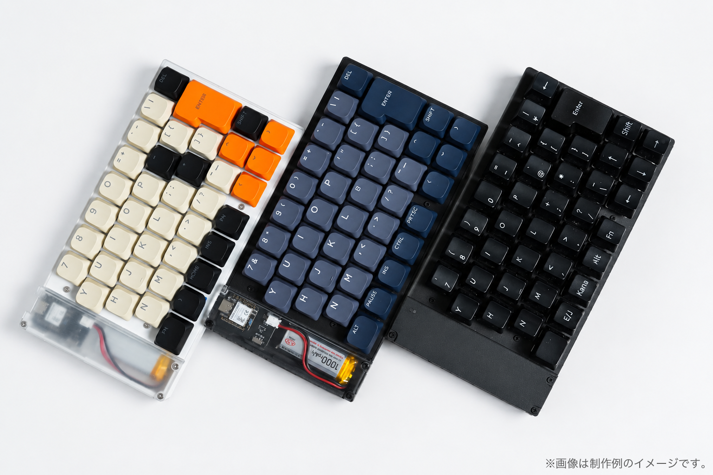
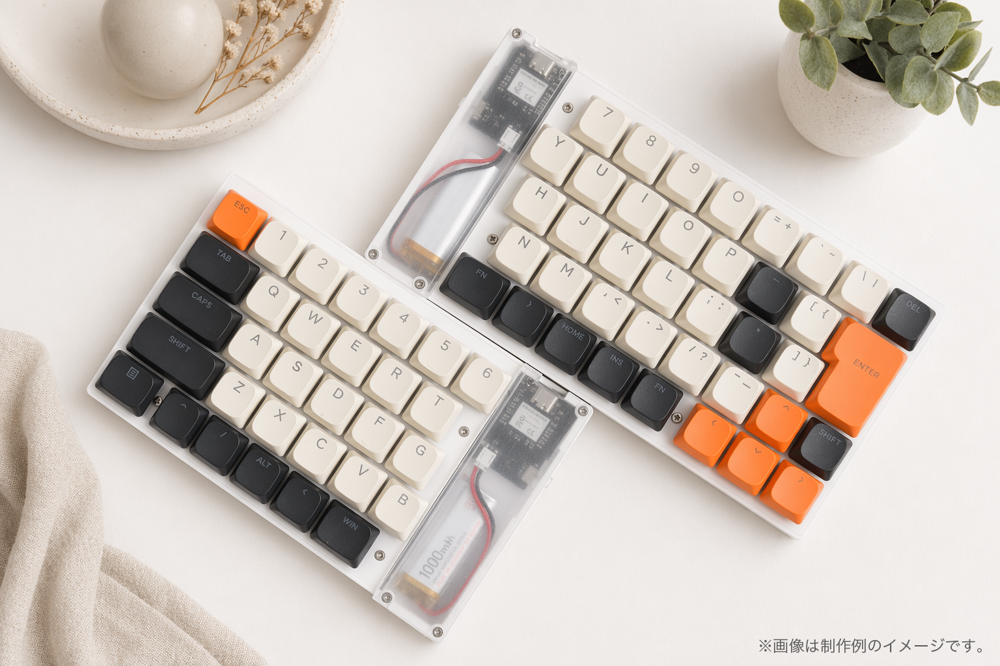
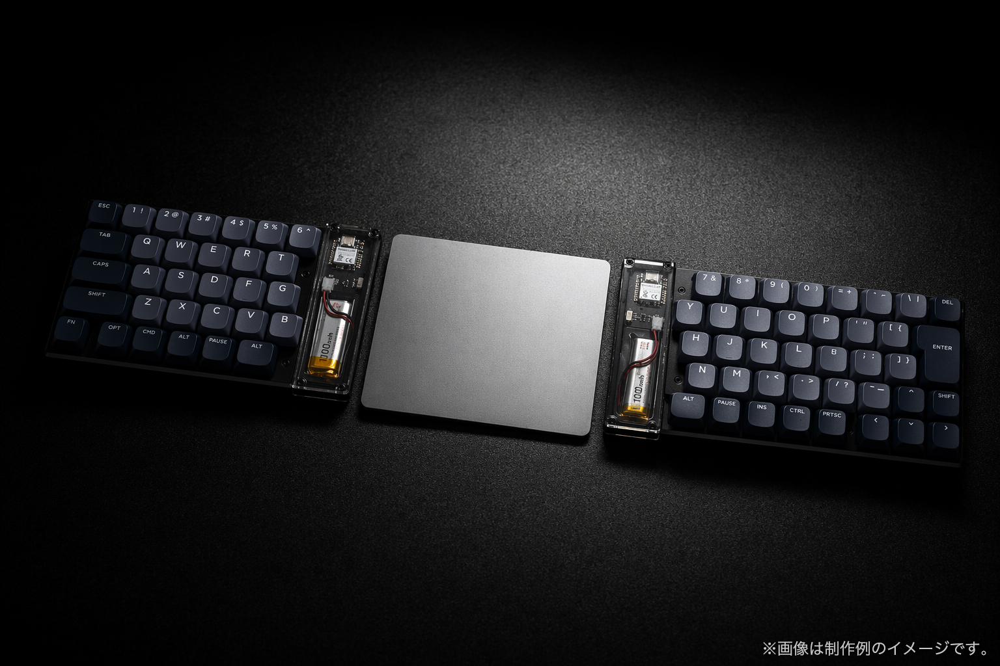

# CLEAVE HHJP
日本語配列互換 / 完全無線 / Choc MX両対応のキーボード自作キット「CLEAVE HHJP」のドキュメントリポジトリです。

  

  
  

購入先：[BOOTH販売ページ](https://rimebeck.booth.pm/items/8395519)

## ドキュメント

- [ビルドガイド](build-guide/README.md)
  組み立て、ファームウェア書き込み、ケース作成、完成後の使い方、カスタマイズ方法をまとめています。

## 関連リンク

- [ファームウェア配布ページ](https://github.com/Rimebeck/Cleave-HHJP/releases)
- [ケースの3Dモデル・PCB 3Dデータ](https://github.com/Rimebeck/Cleave-HHJP/tree/main/models)

## 問い合わせ・不具合報告

ご不明な点はビルドガイドリポジトリの[Issues](https://github.com/Rimebeck/Cleave-HHJP/issues)またはBOOTHの購入者問合せからご連絡ください。
