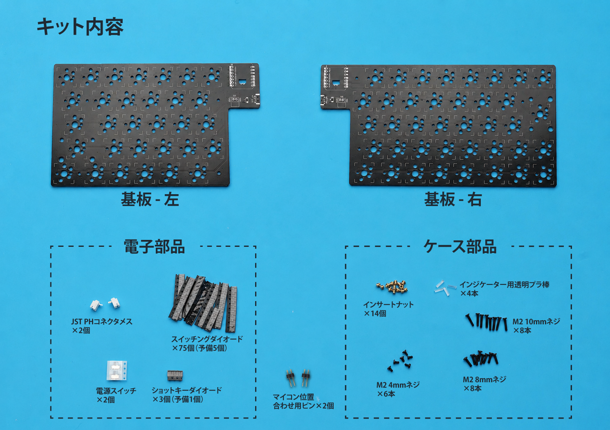

# CLEAVE HHJP 準備ガイド

[目次に戻る](README.md)

CLEAVE HHJP を組み立てる前に、購入・発注・作業環境の準備をまとめて行うためのガイドです。
基板組み立てとケース組み立ての各ガイドでは、このガイドで用意した部品を使って作業する前提で説明します。

## 目次

- [購入・発注前に決めること](#購入発注前に決めること)
- [用意する道具](#用意する道具)
- [電子部品・基板まわり](#電子部品基板まわり)
- [キースイッチ関連](#キースイッチ関連)
- [ケース関連](#ケース関連)
- [準備完了チェック](#準備完了チェック)

## 購入・発注前に決めること

部品を購入・発注する前に、以下を決めておくと必要なものをまとめて揃えやすくなります。

| 決めること | 選択肢 | 影響するもの |
|---|---|---|
| 使用するキースイッチ | MX互換 / ChocV1・V2互換 / 両対応 | ホットスワップソケット、キースイッチ、キーキャップ、トッププレート、トッププレート固定ネジ |
| ケース部品の用意方法と素材 | 自家プリント / 3Dプリントサービス（JLC3DP等）に発注 | 3Dプリント部品、ケース部材 |
| トップカバーのタイプ | インジケーター穴あり / 穴なし | トップカバーのモデル、透明プラ棒の有無 |
| MX用スタビライザー | 使う / 使わない | 2Uスタビライザー |

> [!TIP]
> MXとChocの両方に対応させたい場合は、MX用とChoc用のホットスワップソケットを両方実装します。
> 完成後に切り替えるには、交換先のスイッチ、キーキャップ、トッププレート、対応する長さのM2ネジも必要です。

## 用意する道具

| 道具 | 説明 |
|---|---|
| はんだごてセット | 基板部品のはんだ付けと、ベースケースへのインサートナット熱圧入に使用します。 |
| 先細ピンセット | 小さいチップ部品を扱うために使用します。 |
| マスキングテープ | スルーホールタイプの部品をはんだ付けする際の固定に使用します。 |
| テスター | 電気的な導通テストやバッテリー極性の確認に使用します。必須ではありませんが、強く推奨します。 |
| 精密ドライバー | ケース組み立て時にM2ネジを締めるために使用します。 |
| ニッパーまたはカッター | フォームテープ、滑り止め、透明プラ棒の長さ調整に使用します。 |
| USB Type-Cケーブル | ファームウェアの書き込み、動作確認、充電に使用します。 |

## 電子部品・基板まわり

キットには、基板、基板実装用の電子部品、ケース組み立て用のネジ類などが含まれます。下の表で、キット付属品と別途用意する部品を確認してください。

CLEAVE HHJPをキーボードとして動作させるために最低限必要な部品は以下の通りです。

| 役割 | 部品名 | 数量 | キット付属 | 備考 |
|---|---|---|---|---|
| 基板 | CLEAVE HHJP 基板 - 右 | 1 | ◯ |  |
| 基板 | CLEAVE HHJP 基板 - 左 | 1 | ◯ |  |
| 電源スイッチ | MSK-12C02 2.5H | 2 | ◯ | このケースではノブが高い2.5Hを推奨 |
| スイッチングダイオード | 1N4148W (SOD-123) | 70 | ◯ | チップ表面に「T4」と表記があるもの |
| ショットキーバリアダイオード | B5819W (SOD-123) | 2 | ◯ | チップ表面に「SL」と表記があるもの |
| バッテリーコネクタ | JST PHコネクタ 2ピン L字 | 2 | ◯ |  |
| 位置合わせ用 | 1x2ピンヘッダ（2.54mmピッチ） | 2 | ◯ | XIAO nRF52840 Plus実装時の位置合わせに一時的に使用します。本実装には使用しません。ロットによりXIAO nRF52840 Plusに付属していることがあります。 |
| バッテリー | LiPoバッテリー JST PHコネクタ付き | 2 |  | このケースは最大102050サイズ（厚み10mm × 幅20mm × 長さ50mm）のバッテリーまで対応。購入先例: [Amazon](https://www.amazon.co.jp/dp/B0GFD6DQPP) |
| マイコンボード | XIAO nRF52840 Plus | 2 |  | 左右両側に1個ずつ。"Plus"が必要です。購入先例: [スイッチサイエンス](https://www.switch-science.com/products/10468) / [遊舎工房](https://shop.yushakobo.jp/products/10946) |

## キースイッチ関連

CLEAVE HHJPは、MX互換スイッチとChocV1/V2互換スイッチの両方に対応しており、1つの基板にMX用とChoc用の両方のホットスワップソケットを実装しておくと、一度組み立てた後も気分によって切り替えることも可能です。
使うスイッチのタイプに応じて、以下の部品を用意してください。

### MX互換スイッチを使用する場合

| 役割 | 部品名 | 数量 | 備考 |
|---|---|---|---|
| ホットスワップソケット | CPG151101S11 | 70 | 購入先例: [Amazon](https://www.amazon.co.jp/dp/B0BVH64NXR) |
| キースイッチ | MX互換 | 70 |  |
| キーキャップ | MX互換 | 70個分 | キーレイアウトに合わせて用意します。 |
| スタビライザー | PCBマウント2U | 2 | 任意。購入先例: [遊舎工房](https://shop.yushakobo.jp/products/a0500st) |

### ChocV1/V2互換スイッチを使用する場合

| 役割 | 部品名 | 数量 | 備考 |
|---|---|---|---|
| ホットスワップソケット | CPG135001S30 | 70 | 購入先例: [遊舎工房](https://shop.yushakobo.jp/products/a01ps?variant=37665172553889) |
| キースイッチ | ChocV1/V2 | 70 |  |
| キーキャップ | 使用するChocスイッチのステムに合うキーキャップ | 70個分 | キーレイアウトに合わせて用意します。 |

## ケース関連

ケースの製作に必要な、以下の部品を用意してください。

### 3Dプリント部品

印刷前に、使用するキースイッチの種類とトップカバーのタイプを決めます。

- **使用するキースイッチの種類**: MX互換スイッチ、またはChocV1/V2互換スイッチを選びます。選択したスイッチに合わせてトッププレートを選び、固定にはMX用でM2 10mm、Choc用でM2 8mmのネジを使用します。
- **トップカバーのタイプ**: インジケーター穴あり、または穴なしを選びます。穴ありを選んだ場合は、ケース組み立て時に透明プラ棒を取り付けます。穴なしまたは透明トップカバーを使う場合は不要です。

| 部品 | モデルファイル | 必要数 | 選択条件 |
|---|---|---|---|
| 左ベースケース | [base_case_left.stl](../models/base_case_left.stl) | 1個 | 必須 |
| 右ベースケース | [base_case_right.stl](../models/base_case_right.stl) | 1個 | 必須 |
| 電源スイッチノブ | [power_switch_knob.stl](../models/power_switch_knob.stl) | **2個** | 必須 |
| 左トップカバー | [top_cover_left.stl](../models/top_cover_left.stl) | 1個 | インジケーター穴ありを選択する場合 |
| 右トップカバー | [top_cover_right.stl](../models/top_cover_right.stl) | 1個 | インジケーター穴ありを選択する場合 |
| 左トップカバー | [top_cover_left_no_indicator_hole.stl](../models/top_cover_left_no_indicator_hole.stl) | 1個 | 穴なし。透明樹脂などを使用する場合 |
| 右トップカバー | [top_cover_right_no_indicator_hole.stl](../models/top_cover_right_no_indicator_hole.stl) | 1個 | 穴なし。透明樹脂などを使用する場合 |
| 左MXトッププレート | [top_plate_mx_left.stl](../models/top_plate_mx_left.stl) | 1枚 | MX互換スイッチを使用する場合 |
| 右MXトッププレート | [top_plate_mx_right.stl](../models/top_plate_mx_right.stl) | 1枚 | MX互換スイッチを使用する場合 |
| 左Chocトッププレート | [top_plate_choc_left.stl](../models/top_plate_choc_left.stl) | 1枚 | ChocV1/V2互換スイッチを使用する場合 |
| 右Chocトッププレート | [top_plate_choc_right.stl](../models/top_plate_choc_right.stl) | 1枚 | ChocV1/V2互換スイッチを使用する場合 |

上の表から、決めた構成に対応するモデルを選んで3Dプリントします。

### ベースケース素材の選び方

左右のベースケースは、ケース組み立て時にインサートナットをはんだごてで熱圧入するため、ベースケースには熱可塑性樹脂を選びます。
JLC3DPで発注する場合は、以下の印刷方法と材料が熱可塑性樹脂として使えます。

| 印刷方法 | 材料 |
|---|---|
| MJF | PA12-HP Nylon |
| MJF | PAC-HP Nylon |
| MJF | PA11-HP Nylon |
| SLS | 3301PA Nylon |
| SLS | 3201PA-F Nylon |
| SLS | 1172 Pro Nylon |
| FDM | PLA Plastic |
| FDM | ABS Plastic |
| FDM | ASA Plastic |
| FDM | PA12-CF Plastic（カーボンファイバー入りPA12） |
| FDM | TPU（実用的には非推奨） |

> [!TIP]
> 左右のベースケース素材はPA12-HP Nylonが強度と仕上がりのバランスがよくおすすめですが、ほかの候補と比べるとやや高めです。

> [!NOTE]
> ベースケースは薄く広い構造上、多少の反りが発生することがありますが、PCBをネジ止めすることにより矯正できる場合がほとんどです。
> 気になる場合はドライヤーなどで加熱することで多少の矯正効果が期待できます。

ベースケース以外のトップカバー、電源スイッチノブ、トッププレートはインサートナットを熱圧入しないため、SLA（レジン）やアクリルなど、見た目や加工方法に合わせて自由に選んで構いません。例えばトップカバーを8001レジン（透明や半透明）で印刷するとバッテリーやマイコンが透けて見えます。

### 3Dプリント部品以外で用意する部材

3Dプリントしたケース部品に加えて、以下の部材も必要になります。

| 役割 | 部品名 | 数量 | キット付属 | 備考 |
|---|---|---|---|---|
| インサートナット | M2xL3xOD3.2 | 14個 | ◯ |  |
| ネジ | M2 8mm | 8本 | ◯ | Chocトッププレート用 |
| ネジ | M2 10mm | 8本 | ◯ | MXトッププレート用 |
| ネジ | M2 4mm | 6本 | ◯ | トップカバー用 |
| インジケーターランプ | 直径2mm透明プラ棒（3mm程度） | 4本 | ◯ | インジケーター穴ありトップカバーを使う場合に使用。穴なしまたは透明トップカバーを使う場合は不要 |
| フォームテープ | フォームテープ2mm厚/~3mm幅 | 2m程度 |  | 購入例: [Amazon](https://www.amazon.co.jp/dp/B0CG9N7B5M) 購入例は幅5mmのため、半分程度に割いて使用します。 |
| バッテリー固定用両面テープ | 薄手の両面テープ | 2枚程度 |  | ケース内でバッテリーを固定するために使用します。 |
| 滑り止めシート | ポロンシートなど |  |  | 任意。購入例: [Amazon](https://www.amazon.co.jp/gp/product/B00G4682FY) |

## 準備完了チェック

- [ ] 使用するキースイッチの種類（MX / Choc / 両対応）を決めた
- [ ] ケース部品の用意方法（自家プリント / 3Dプリントサービスに発注）を決めた
- [ ] トップカバーのタイプ（インジケーター穴あり / 穴なし）を決めた
- [ ] 必要な工具とUSB Type-Cケーブルを用意した
- [ ] 必要な部品をすべて揃えた

準備ができたら、[基板組み立てガイド](01-ASSEMBLY.md)に進んでください。
