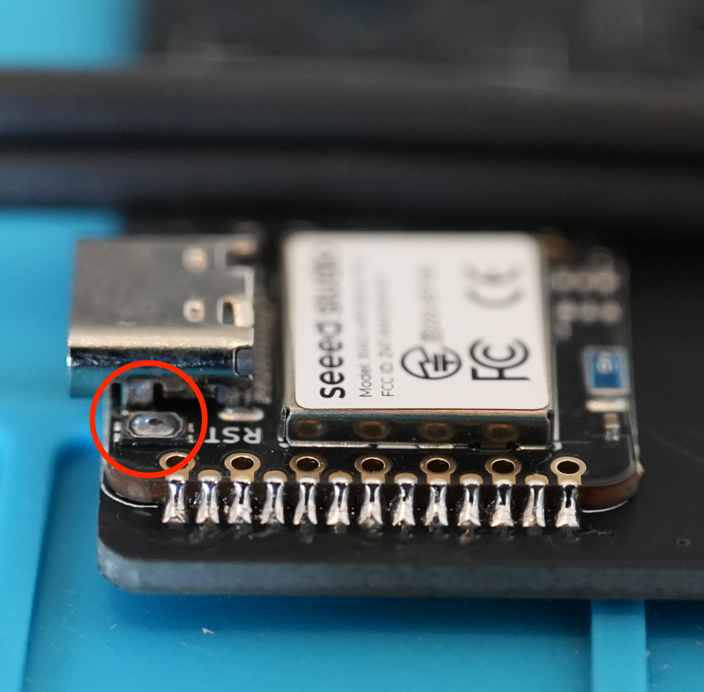

# ファームウェアのダウンロード・書き込み・接続確認

[目次に戻る](README.md)

Cleave HHJPはファームウェアをダウンロードし、左右それぞれのXIAO nRF52840 Plusへ書き込み、接続確認を行います。

## 目次

- [ファームウェアのダウンロード](#ファームウェアのダウンロード)
- [ブートローダーモードへの入り方](#ブートローダーモードへの入り方)
- [ファームウェアの書き込み](#ファームウェアの書き込み)
- [接続確認・動作確認](#接続確認動作確認)
- [トラブルシューティング](#トラブルシューティング)

書き込みには、キーボード本体のファームウェアに加えて、Bluetoothペアリング情報や永続化設定を初期化するための`settings_reset`用ファームウェアを使用します。

## ファームウェアのダウンロード

[ファームウェアのダウンロードページ](https://github.com/Rimebeck/Cleave-HHJP/releases)から最新バージョンの以下のUF2ファイルをダウンロードしてください。

- `settings_reset-seeeduino_xiao_ble-zmk.uf2`
- `cleave_hhjp_left.rgbled_adapter-seeeduino_xiao_ble-zmk.uf2`
- `cleave_hhjp_right.rgbled_adapter-seeeduino_xiao_ble-zmk.uf2`

> [!NOTE]
> `settings_reset`用ファームウェアは、分割キーボードのペアリングやBluetooth接続に関する設定を初期化するために書き込むクリーンアップ用のファームウェアです。

## ブートローダーモードへの入り方

XIAO nRF52840 Plusをブートローダーモードにすると、`XIAO-SENSE`という名前のUSBドライブとして認識されます。

1. PCと書き込み対象のXIAO nRF52840 PlusをUSB Type-Cケーブルで接続します。
2. RESETボタンを爪楊枝の柄側などを使い素早く2回押します。（ダブルクリック）

    

3. `XIAO-SENSE`ドライブが表示されます。

## ファームウェアの書き込み

UF2ファイルは、`XIAO-SENSE`ドライブへドラッグ&ドロップ、またはFinder / エクスプローラーからコピーして書き込みます。

1. 左側のXIAO nRF52840 Plusをブートローダーモードにします。
2. `XIAO-SENSE`ドライブに`settings_reset-seeeduino_xiao_ble-zmk.uf2`を書き込みます。
3. 書き込みが完了すると`XIAO-SENSE`ドライブが消え、自動的に再起動します。
4. もう一度ブートローダーモードにします。
5. `XIAO-SENSE`ドライブに`cleave_hhjp_left.rgbled_adapter-seeeduino_xiao_ble-zmk.uf2`を書き込みます。
6. 右側も同様に、`settings_reset-seeeduino_xiao_ble-zmk.uf2`と`cleave_hhjp_right.rgbled_adapter-seeeduino_xiao_ble-zmk.uf2`を順番に書き込みます。
7. 両方の書き込みが完了したら左右の電源を入れます。
8. PCのBluetooth設定で`Cleave HHJP`が認識され、接続できれば書き込みは完了です。
> [!NOTE]
> macOSではUF2ファイルのコピー後にエラーが表示される場合がありますが、コピー後に`XIAO-SENSE`ドライブが消えて自動的に再起動していれば、書き込みは完了しています。

## 接続確認・動作確認

基板組み立てガイドで仮取り付けしたキースイッチを使い、Bluetooth接続が完了したら、すべてのキーが認識されるか確認してください。

左右間のペアリングは電源を入れると自動的に行われます。

### 左右のペアリングについて

ZMKの分割キーボードでは、左右は**シールド名から生成されるBluetooth UUID**を使って自動的にペアリングされます。

Bluetoothの接続範囲内にすでに動作しているCleave HHJPが存在する場合は、初回起動時に意図しない組み合わせでペアリングされる可能性があります。

**安全な運用方法**

- **初回セットアップ時**: 1ペアずつ電源を入れてペアリングを確立する
- **ペアリングリセット後**: 他のペアの電源を切った状態で再ペアリングする

一度正しくペアリングが確立すれば、MACアドレスで記憶されるため、以降は複数ペアを同時に使用しても問題ありません。

## トラブルシューティング

### ブートローダーモードに入らない

- RESETボタンを素早く2回押しているか確認します。うまく入らない場合は、少し間隔を空けて2回押し直してください。
- USB Type-Cケーブルが充電専用ではなく、データ通信に対応しているものか確認します。
- `XIAO-SENSE`ドライブが表示されない場合は、一度USBケーブルを抜き差ししてから再度RESETボタンを2回押します。
- 左右をケースに入れた後は、RESETボタンに工具が届くか確認してから作業してください。

### UF2コピー後にドライブが消えない

UF2ファイルの書き込みが成功すると、`XIAO-SENSE`ドライブは自動的に消えて再起動します。

- コピーしたUF2ファイルが対象の側と合っているか確認します。左側には`cleave_hhjp_left...uf2`、右側には`cleave_hhjp_right...uf2`を書き込みます。
- `settings_reset`を書き込んだ後は、もう一度ブートローダーモードに入ってから左右それぞれのUF2を書き込みます。
- ドライブが消えない場合は、ファイルを削除してやり直すのではなく、USBケーブルを抜き差ししてブートローダーモードに入り直してから再度コピーします。
- macOSではコピー後にエラーが表示される場合がありますが、`XIAO-SENSE`ドライブが消えて再起動していれば書き込みは完了しています。

### Bluetoothに表示されない

- 左右両方の電源スイッチがONになっているか確認します。
- PCやスマートフォン側に古い`Cleave HHJP`の登録が残っている場合は、登録を削除してから再検索します。
- 初回セットアップでは、近くにある他のCleave HHJPの電源を切り、1ペアだけを起動してペアリングします。
- 左右のUF2を書き込む前に`settings_reset`を書き込んだか確認します。未実施の場合は、左右とも`settings_reset`から書き込み直します。

### 左右が接続しない

- 左右に正しいUF2を書き込んでいるか確認します。左基板には左用、右基板には右用のUF2を書き込みます。
- 左右の電源を一度OFFにし、左側、右側の順に電源を入れ直します。
- 近くに別のCleave HHJPがある場合は、他のペアの電源を切ってから再ペアリングします。
- それでも接続しない場合は、左右両方に`settings_reset`を書き込み、その後に左右それぞれのUF2を書き込み直します。

### 一部のキーが反応しない

- 反応しないキーのキースイッチがホットスワップソケットに正しく差し込まれているか確認します。スイッチのピンが曲がっている場合は、まっすぐに直して差し込み直します。
- 該当キーのホットスワップソケットのはんだ付けに浮きや未はんだがないか確認します。
- ダイオードの向きが正しいか確認します。スイッチングダイオードは、部品の線がフットプリントのコの字側に合っている必要があります。
- 複数のキーがまとまって反応しない場合は、XIAO nRF52840 Plus周辺のはんだブリッジや未はんだを確認します。
- 右側だけが反応しない場合は、左右間の接続が確立しているかを先に確認します。

## ステップの完了
おめでとうございます！これで基板単体でのファームウェア書き込みと動作確認が完了しました。
ケースなしの状態は動作確認用です。続いてケースを組み立て、常用できる状態に仕上げます。
- [次: Cleave HHJP ケースビルドガイド](03-CASE.md)
- [目次に戻る](README.md)
