# CLEAVE HHJP 簡易ケースビルドガイド

[目次に戻る](README.md)

簡易ケースキットを使用して、CLEAVE HHJP のケースを作成する方法について説明します。

## 目次

- [ケースの構成](#ケースの構成)
- [ケース組み立て前の状態確認](#ケース組み立て前の状態確認)
- [ケース組み立て手順](#ケース組み立て手順)
- [参考: 完成状態](#参考-完成状態)

## ケースの構成

簡易ケースは、ボトムプレートとトッププレートでPCBを挟み込む「サンドイッチ構造」のケースです。加えてトップカバーなどを組み合わせて作成します。

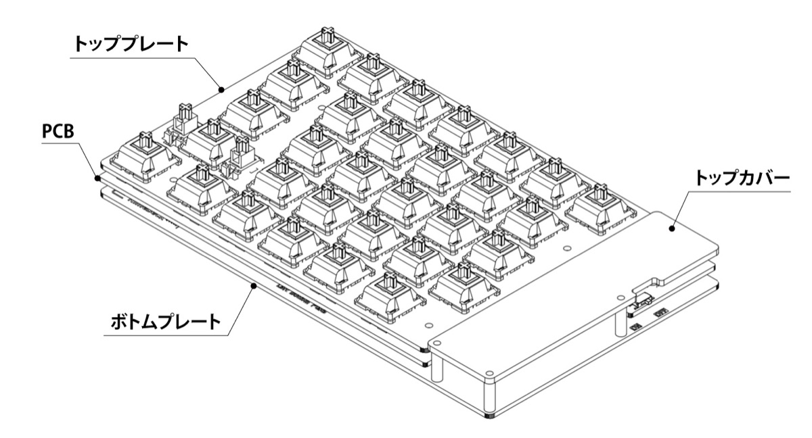

## ケース組み立て前の状態確認

基板単体でのファームウェア書き込みと動作確認が済んだら、以下の状態に応じてケースへ組み込みます。

| 現在の状態 | 進め方 |
|---|---|
| キースイッチを基板単体での動作確認準備として仮取り付けしている | いったんスイッチを外し、このガイドの「4. キースイッチ取り付け」でトッププレートと一緒に取り付け直します。 |
| MXスタビライザーを使う | 仮取り付け済みの場合は外す必要はありません。まだ取り付けていない場合は、キースイッチを取り付ける前にPCBへ取り付けます。トッププレートやPCBと干渉しないことを確認しながら組み込みます。 |
| バッテリーを基板単体での動作確認準備として接続している | ケースへ組み込む前にいったんバッテリーを外し、このガイドの「7. バッテリーの固定」で接続し直して収まりと固定を確認します。 |
| キースイッチやバッテリーをまだ取り付けていない | このガイドの手順に沿って、キースイッチ取り付けとバッテリー固定を行います。 |

## ケース組み立て手順

> [!NOTE]
> **左右両方で作業してください**
>
> このガイドでは写真が左側のみ掲載されていますが、特に記載がない限り、同じ手順を左右の両方で行ってください。

### 1. 簡易ケース部品の確認
組み立てを始める前に、以下の簡易ケースキットの内容物、本体キットから流用する部品、別途用意する材料・道具が揃っていることを確認します。

#### 簡易ケースキットの内容物
| 部品名 | 数量 | 備考 |
|---|---|---|
|ボトムプレート|左右各1枚||
|トッププレート|左右各1枚||
|トップカバー|2枚||
|スペーサー M2ネジ付き 4mm|8個|ボトムケース - 基板|
|スペーサー M2ネジ付き 11mm|6個|ボトムケース - トップカバー|
|スペーサー ネジなし 3.4mm|8個|MXスイッチ使用時 / 3Dプリント品|
|スペーサー ネジなし 0.6mm|8個|Chocスイッチ使用時 / 3Dプリント品|
|M2 3mmネジ|14本||
|M2 5mmネジ|8本|Chocスイッチ使用時|
|ゴム足|8個||

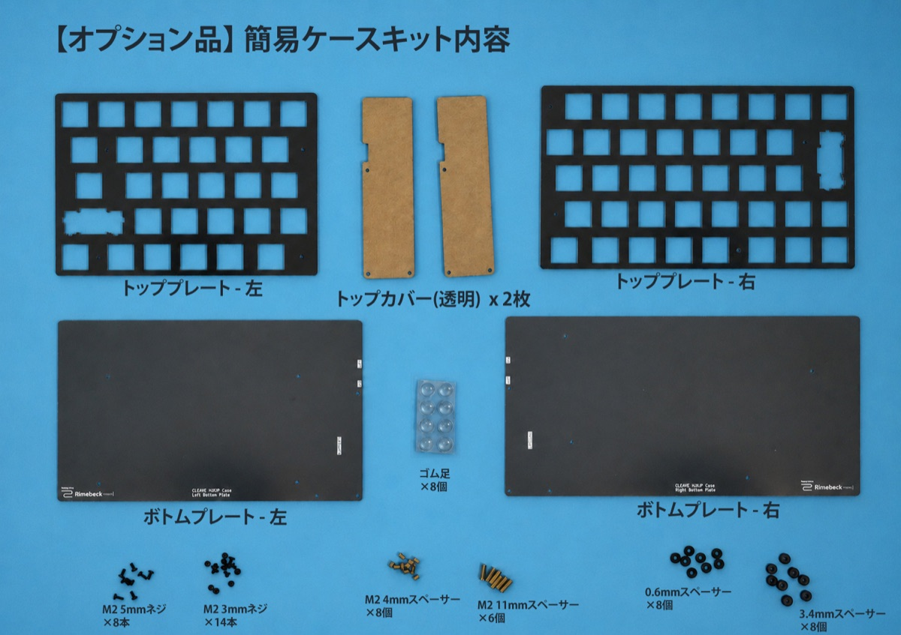

#### 本体キットの標準ケース用部品から流用する部品
| 部品名 | 数量 | 備考 |
|---|---|---|
|M2 4mmネジ|6本|トップカバー固定用|
|M2 8mmネジ|8本|MXスイッチ使用時|

> [!NOTE]
> 簡易ケースでは、トッププレート固定用のネジ長が標準ケースと異なります。MX互換スイッチではM2 8mmネジ、ChocV1/V2互換スイッチではM2 5mmネジを使用します。

#### 別途用意する材料
| 部品名 | 数量 | 備考 |
|---|---|---|
|両面テープ（0.1mm厚程度）|適量|スペーサー固定用|

#### 別途用意する道具
| 道具名 | 数量 | 備考 |
|---|---|---|
|プラス精密ドライバー|必須||
|ピンセット|任意||
|スパナ・ラジオペンチ|任意|対辺3mmの六角スペーサーを保持できるもの|

**完了チェック**

- [ ] 簡易ケース組み立てに必要な部品・道具をすべて用意した

### 2. スペーサーネジの取り付け
ボトムプレートの印字がされている面にスペーサー M2ネジ付き 4mmとスペーサー M2ネジ付き 11mmを配置し、それぞれ裏面からM2 3mmネジで固定します。
4mmと11mmどちらを取り付けるかは下記の図を参考にしてください。

緑色：4mm / オレンジ色：11mm

#### 右側
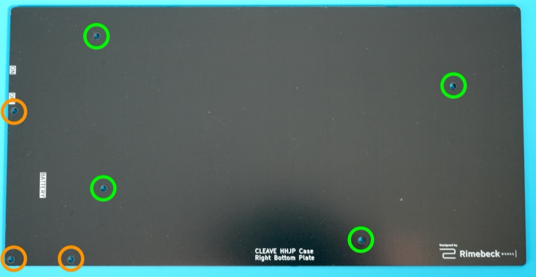

#### 左側
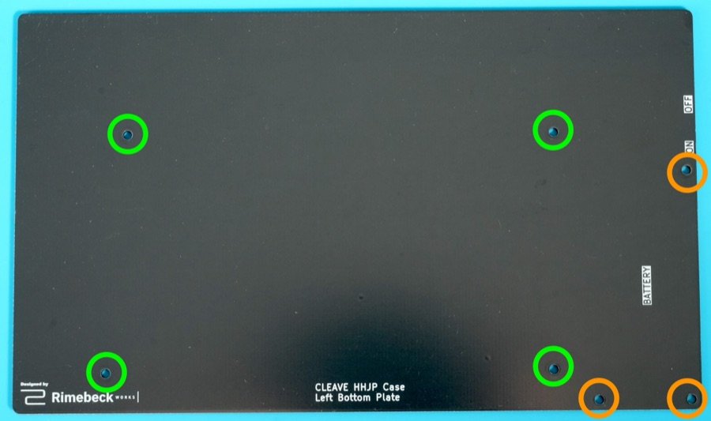

このステップが完了すると以下のようになります。

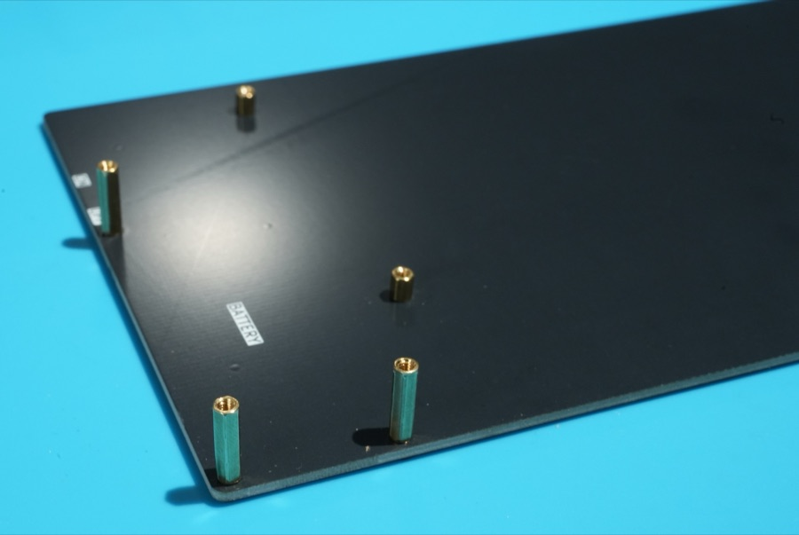

**完了チェック**

- [ ] 4mm スペーサーを全8箇所取り付けた
- [ ] 11mmスペーサーを全6箇所取り付けた

### 3. スペーサーの取り付け
トッププレートの裏面（文字が印字してある面）にスペーサーを取り付けます。
- MX互換スイッチを使用する場合は3.4mm 
- ChocV1/V2互換スイッチを使用する場合は0.6mm

のスペーサーを使用します。ネジ穴を塞がないように両面テープでトッププレートとスペーサーを貼り付けます。
このときに穴とスペーサーにネジを通して位置決めをすると正確に貼り付けることができます。

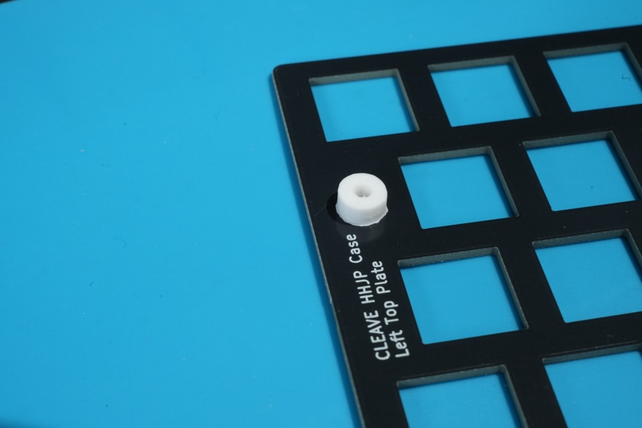

> [!NOTE]
> 画像はわかりやすいようにトッププレートとスペーサーの色を変えていますが、実際にはトッププレートと同系色のスペーサーが提供されます。

**完了チェック**

- [ ] 使用するスイッチに応じたスペーサーを全8箇所取り付けた

### 4. キースイッチ取り付け
MX互換スイッチとChocV1/V2互換スイッチのどちらかをトッププレートにはめ込みます。

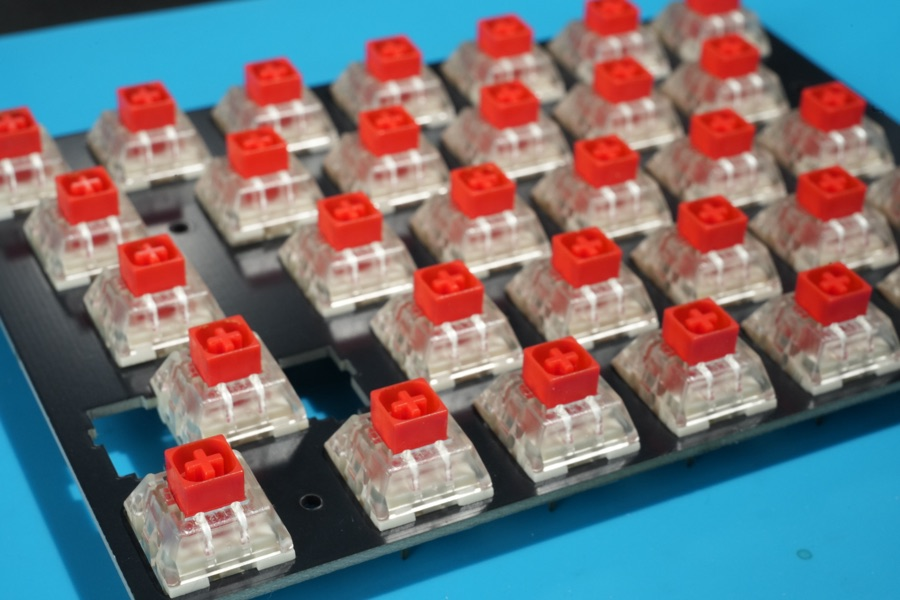

PCBを確認しながらスイッチの上下の向き（ピンが上下どちらに位置するか）に注意してください。

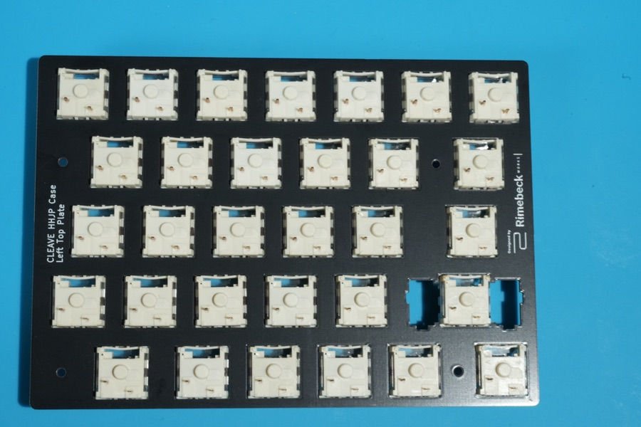

> [!NOTE]
> 右側エンターキーのみスタビライザー穴の都合上スイッチが保持されづらくなっています。そのスイッチのみ次のステップで取り付けても問題ありません。

**完了チェック**

- [ ] スイッチがトッププレートにはまっており、向きが正しい

### 5. トッププレートの取り付け
PCBにスイッチを差し込みながらトッププレートとPCBを組み合わせます。
一気に差し込むのではなく、端のスイッチから徐々にソケットに差し込むと安定的に差し込めます。
スペーサーがずれないように注意してください。

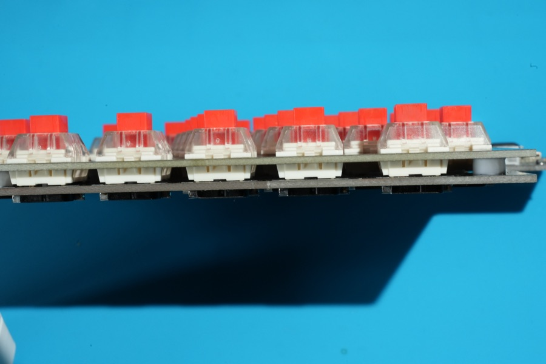

> [!NOTE]
> Chocスイッチを使用する場合、PCBとトッププレートの隙間が微小になりますが、接触することはありません。
> 接触している場合はスイッチがトッププレートに完全にはまっていない状態なので完全にはめ込んでください。
> 参考画像：
> 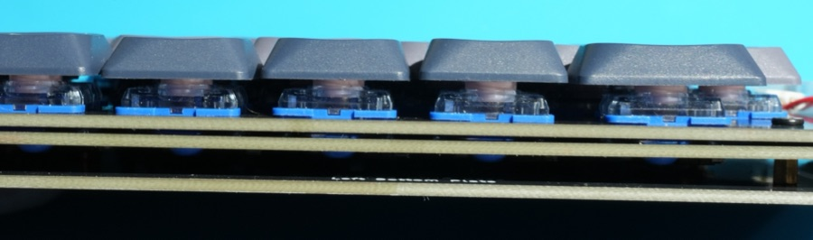

このときにスイッチのピンが折れ曲がらないように注意します。PCBを裏返してソケットにピンが正常に差し込まれているか確認できます。

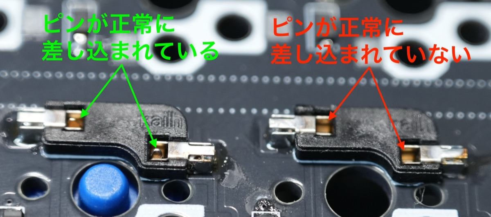

完了すると以下のようになります。（MXスイッチ、スタビライザーありの場合）

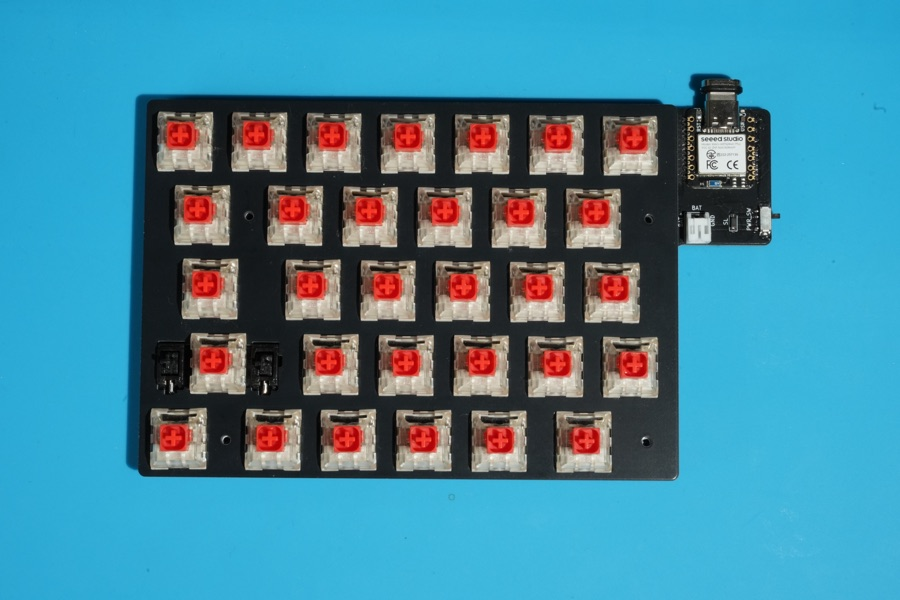

**完了チェック**

- [ ] スイッチがトッププレートとPCBの両方に正しく入っている
- [ ] スイッチのピンが曲がらず、PCBのソケットに入っている

### 6. PCBの取り付け
「2. スペーサーネジの取り付け」でネジ付きスペーサーを装着したボトムプレートにPCBとトッププレートとキースイッチが一体になった部品を装着します。

- MX互換スイッチを使用する場合はM2 8mmネジ（本体キットの標準ケース用部品を流用）
- ChocV1/V2互換スイッチを使用する場合はM2 5mmネジ

を使用します。

トッププレートのネジ穴とボトムプレートの4mmスペーサーの位置が合うように調整し、左右それぞれ4箇所をトッププレート側からネジ止めします。
このときにネジ付きスペーサーが緩まないようにスパナやラジオペンチなどで押さえながら取り付けると確実にネジを締め付けることができます。

**完了チェック**

- [ ] 左右それぞれ4箇所を、使用するスイッチに合った長さのM2ネジで固定した
- [ ] ネジを締めすぎてケースやトッププレートが変形していない

### 7. バッテリーの固定
外しておいたバッテリーをコネクタに差し込み直して、ボトムプレートの「BATTERY」と記載のある部分に両面テープで貼り付けます。

|シルクスクリーンの印刷|極性|
|---|---|
|BAT+|正極（赤色のケーブル）|
|GND|負極（黒色のケーブル）|

> [!CAUTION]
> LiPoバッテリーはショートや強い曲げ、穴あき、圧迫で発熱・発火する可能性があります。接続作業中はUSBケーブルを抜き、電源スイッチをOFFにします。赤黒のリード線やコネクタ端子を金属工具で同時に触れないでください。
> バッテリーの極性を間違えて接続するとマイコンが壊れて修復不能になる場合があります。バッテリーやケーブルがネジ穴、トップカバー、PCBに挟まれないことも確認してください。

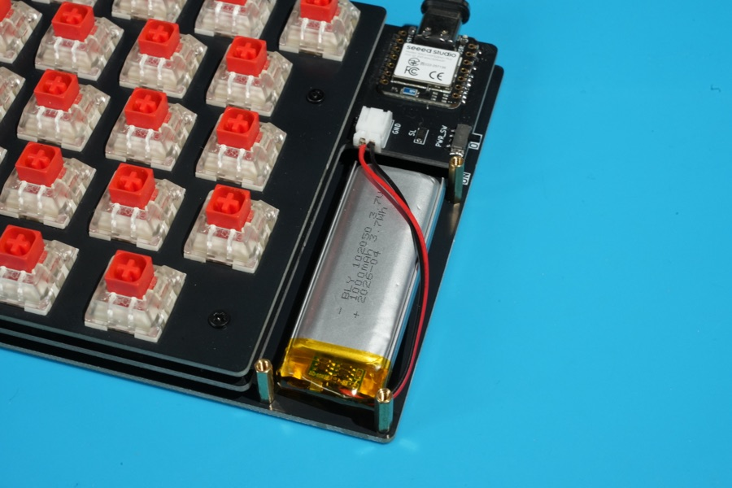

**完了チェック**

- [ ] バッテリーコネクタが奥まで差し込まれている
- [ ] `BAT+`に赤色のケーブル、`GND`に黒色のケーブルが接続されている
- [ ] バッテリーがケース内のスペースに収まっている
- [ ] バッテリーやケーブルがトップカバー、PCBなどに挟まれない
- [ ] バッテリーがケース内で動かないように固定されている

### 8. トップカバーの取り付け
裏表の保護フィルムを剥がして透明なアクリルの状態にしたトップカバーを左右それぞれ3箇所のM2 4mmネジ（本体キットの標準ケース用部品を流用）で固定します。
このときにネジ付きスペーサーが緩まないようにスパナやラジオペンチなどで押さえながら取り付けると確実にネジを締め付けることができます。

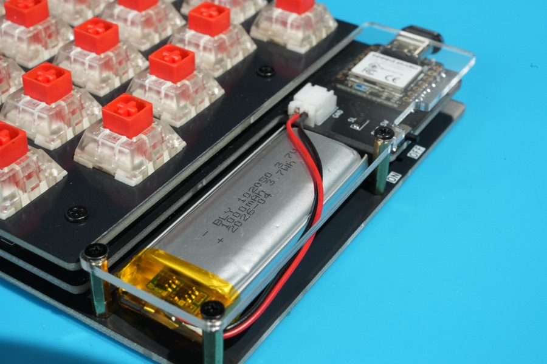

**完了チェック**

- [ ] トップカバーを左右それぞれ3箇所のM2 4mmネジで固定した

### 9. ゴム足の取り付け
本体を裏返してボトムプレートにゴム足を貼り付けます。ネジを避けてボトムプレートの四隅に貼り付けます。
キーボードに傾斜を付けたい場合は奥側のみに貼り付けることもできます。お好みに応じて位置や個数を変更してください。

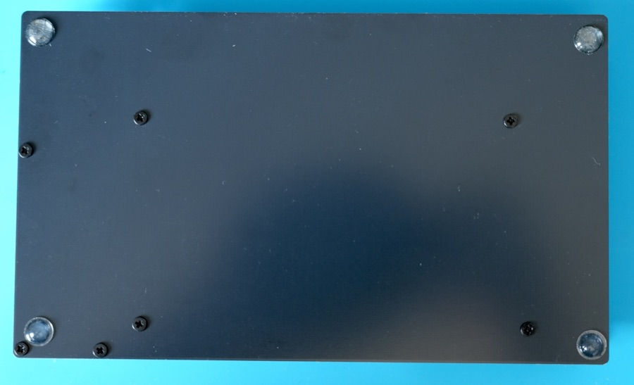

**完了チェック**

- [ ] ゴム足を貼り、キーボードを置いたときにがたつきがないことを確認した

## 参考: 完成状態
ケースの組み立てが完了すると、以下のような状態になります。
お好みのキーキャップを取り付ければ使用準備は完了です。

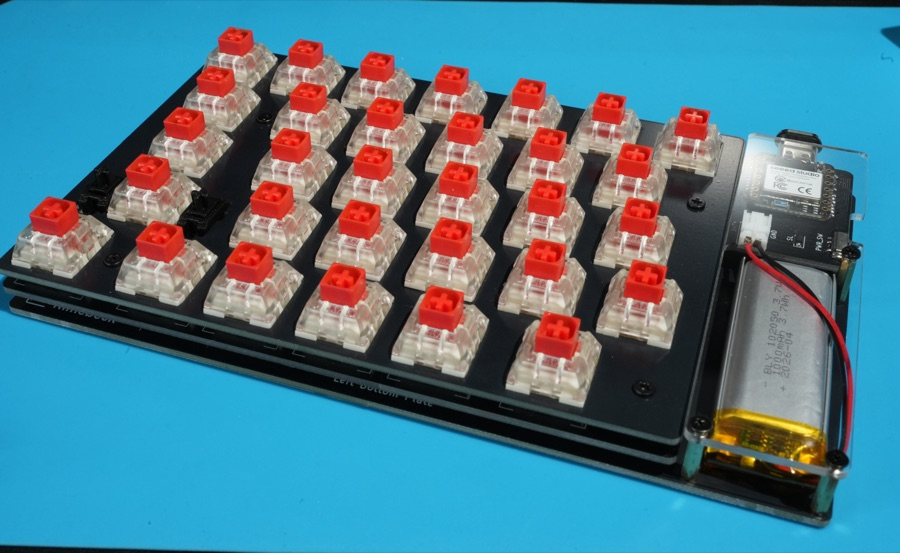

## ステップの完了
ついにキーボードが完成しました。
次のガイドではこのキーボードの使い方を確認しましょう。
- [前: ファームウェアのダウンロード・書き込み・接続確認](02-FIRMWARE.md)
- [次: 完成後の使い方](04-USAGE.md)
- [目次に戻る](README.md)
