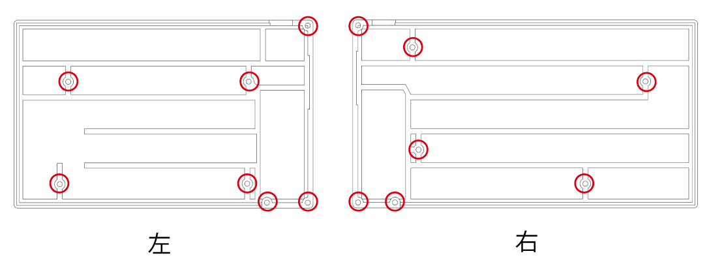
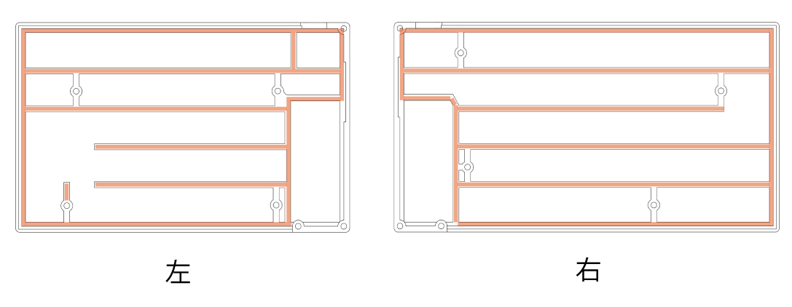

# CLEAVE HHJP ケースビルドガイド

[目次に戻る](README.md)

配布されている3Dモデルを使用して、CLEAVE HHJP のケースを作成する方法について説明します。

## 目次

- [ケースの構成](#ケースの構成)
- [ケース組み立て前の状態確認](#ケース組み立て前の状態確認)
- [ケース組み立て手順](#ケース組み立て手順)
- [参考: 完成状態](#参考-完成状態)

## ケースの構成

ケースは、ベースケース（Base case）、PCB、トッププレート、トップカバー、キースイッチなどを組み合わせて作成します。

ケースに必要な3Dプリント部品、ケース部材、素材の選び方は[準備ガイドのケース関連](00-PREPARE.md#ケース関連)で確認してください。

## ケース組み立て前の状態確認

基板単体でのファームウェア書き込みと動作確認が済んだら、以下の状態に応じてケースへ組み込みます。

| 現在の状態 | 進め方 |
|---|---|
| キースイッチを基板単体での動作確認準備として仮取り付けしている | いったんスイッチを外し、このガイドの「4. キースイッチ取り付け」でトッププレートと一緒に取り付け直します。 |
| MXスタビライザーを基板単体での動作確認準備として仮取り付けしている | いったんスタビライザーを外し、このガイドの「4. キースイッチ取り付け」でトッププレートと一緒に取り付け直します。 |
| バッテリーを基板単体での動作確認準備として接続している | ケースへ組み込む前にいったんバッテリーを外し、このガイドの「8. バッテリーの固定」で接続し直して収まりと固定を確認します。 |
| キースイッチやバッテリーをまだ取り付けていない | このガイドの手順に沿って、キースイッチ取り付けとバッテリー固定を行います。 |

## ケース組み立て手順

> [!NOTE]
> **左右両方で作業してください**
>
> このガイドでは写真や説明が片側のみの場合がありますが、特に記載がない限り、同じ手順を左用・右用の両方で行ってください。

### 1. ケース部品の確認
組み立てを始める前に、[準備ガイドのケース関連](00-PREPARE.md#ケース関連)で用意した部品が揃っていることを確認します。
3Dプリント部品のモデル選択、ベースケース素材、トップカバーのタイプは準備ガイドで決めた内容に従ってください。

**確認するもの**

- 左右のベースケース
- 左右のトップカバー
- 左右の電源スイッチノブ
- 使用するキースイッチに対応した左右のトッププレート
- インサートナット、M2ネジ、フォームテープ
- インジケーター穴ありトップカバーを使う場合は、透明プラ棒
- 必要に応じて滑り止めシート

**完了チェック**

- [ ] 選択した構成に必要なケース部品をすべて用意した
- [ ] 組み立てに必要なネジ、インサートナット、フォームテープなどの部材を用意した
- [ ] ねじ穴、インサートナット穴、スイッチ穴などに造形残りや穴詰まりがない

### 2. インサートナットの取り付け
下図の赤丸で示した左右それぞれ7箇所に、インサートナットをはんだごてで熱圧入します。
ナットの上面とケースの上面が揃うところまで押し込みます。

TODO圧入している図

**完了チェック**

- [ ] 左右それぞれ7箇所にインサートナットを取り付けた
- [ ] インサートナットの上面がケースの上面から大きく飛び出していない
- [ ] インサートナットが傾いていない
- [ ] ネジを軽く入れて、無理なく回ることを確認した

### 3. フォームテープの貼り付け
下図のオレンジ色で示した梁の部分にフォームテープを貼ります。
インサートナットやネジ穴を塞がないようにしてください。

**完了チェック**

- [ ] フォームテープがケース内側の梁に沿って貼られている
- [ ] インサートナットやネジ穴をフォームテープで塞いでいない

### 4. キースイッチ取り付け
MX互換スイッチとChocV1/V2互換スイッチでは、使用するトッププレートが異なります。
上下の向きに注意してスイッチをトッププレートにはめ込みます。

**完了チェック**

- [ ] 使用するキースイッチに合ったトッププレートを用意した
- [ ] スイッチのピンが曲がっていない
- [ ] スイッチがトッププレートにはまっている

### 5. トッププレートの取り付け
PCBにスイッチを差し込みながらサンドイッチします。
このときにスイッチのピンが折れ曲がらないように注意します。一気に差し込むのではなく、端のすいっちから徐々にソケットに差し込むと安定的に差し込めます。

**完了チェック**

- [ ] スイッチがトッププレートとPCBの両方に正しく入っている
- [ ] スイッチのピンが曲がらず、PCBのソケットに入っている

### 6. 電源スイッチノブの取り付け
ケースの内側から電源スイッチノブを差し込みます。

| 電源スイッチノブをケースの裏側から通して→ | ケースの外側にノブを出す |
|---|---|
|  |  |

**完了チェック**

- [ ] 電源スイッチノブを取り付け、引っかからず左右に動くことを確認した

### 7. PCBの取り付け
ベースケースにPCBとトッププレートとキースイッチが一体になった部品を装着します。
電源スイッチの窪みにPCBの電源スイッチのノブが刺さるようにスライドさせながらはめ込みます。

トッププレートのフチがベースケースにぴったり合うように調整し、左右それぞれ4箇所を、ChocトッププレートではM2 8mm、MXトッププレートではM2 10mmのネジで固定します。

**完了チェック**

- [ ] PCB、トッププレート、キースイッチがベースケースに収まっている
- [ ] 電源スイッチノブで基板上の電源スイッチを操作できる
- [ ] トッププレートのフチがベースケースに沿っている
- [ ] 左右それぞれ4箇所を、使用するトッププレートに合った長さのM2ネジで固定した
- [ ] ネジを締めすぎてケースやトッププレートが変形していない

### 8. バッテリーの固定
外しておいたバッテリーをコネクタに差し込み直して、バッテリー用のスペースに格納します。
バッテリーが振動などで破損しないように、バッテリー裏面を両面テープなどでケースに固定することを強く推奨します。

|シルクスクリーンの印刷|極性|
|---|---|
|BAT+|正極（赤色のケーブル）|
|GND|負極（黒色のケーブル）|

> [!CAUTION]
> LiPoバッテリーはショートや強い曲げ、穴あき、圧迫で発熱・発火する可能性があります。接続作業中はUSBケーブルを抜き、電源スイッチをOFFにします。赤黒のリード線やコネクタ端子を金属工具で同時に触れないでください。
> バッテリーの極性を間違えて接続するとマイコンが壊れて修復不能になる場合があります。バッテリーやケーブルがネジ穴、トップカバー、PCBに挟まれないことも確認してください。

**完了チェック**

- [ ] バッテリーコネクタが奥まで差し込まれている
- [ ] `BAT+`に赤色のケーブル、`GND`に黒色のケーブルが接続されている
- [ ] バッテリーがケース内のスペースに収まっている
- [ ] バッテリーやケーブルがネジ穴、トップカバー、PCBに挟まれない
- [ ] バッテリーがケース内で動かないように固定されている

### 9. インジケーターの取り付け
> [!NOTE]
> インジケーター穴ありトップカバーを使う場合のみ行います。穴なしトップカバーを使う場合は、このステップは実施不要です。
直径2mm透明プラ棒（3mm程度）をトップカバーに差し込みます。
接着はまだしません。

**完了チェック**

- [ ] 透明プラ棒を左右それぞれ必要な位置に差し込んだ

### 10. トップカバーの取り付け
インジケーターを付けた場合はここでPCBとインジケーターの隙間を調整し、上面に出ている不要な分はニッパーなどで切って調整したあとに接着剤などを使ってカバーの側から接着してください。

トップカバーを左右それぞれ3箇所のM2 4mmネジで固定します。

**完了チェック**

- [ ] （インジケーターありの場合）透明プラ棒の長さを調整して固定した
- [ ] トップカバーを左右それぞれ3箇所のM2 4mmネジで固定した
- [ ] トップカバーが浮かず、ベースケースに沿っている

### 11. キーキャップの取り付け
用意したキーキャップをスイッチに装着します。

**完了チェック**

- [ ] すべてのキーキャップを取り付けた
- [ ] キーキャップが隣のキーやケースに干渉せず、必要なキーを押せることを確認した

### 12. 滑り止めの取り付け（任意）
3Dプリントしたケースや使うデスクの材質によってはキーボードが滑ることがあるので、お好みに応じてケースの裏側に両面テープなどでポロンシートやすべり止めシートを貼り付けます。

**完了チェック**

- [ ] 必要に応じて滑り止めを貼り、キーボードを置いたときにがたつきがないことを確認した

## 参考: 完成状態
ケースの組み立てが完了すると、以下のような状態になります。写真はChocキースイッチとChoc用キーキャップを使用した例です。

## ステップの完了
ついにキーボードが完成しました。
次のガイドではこのキーボードの使い方を確認しましょう。
- [次: 完成後の使い方](04-USAGE.md)
- [目次に戻る](README.md)
