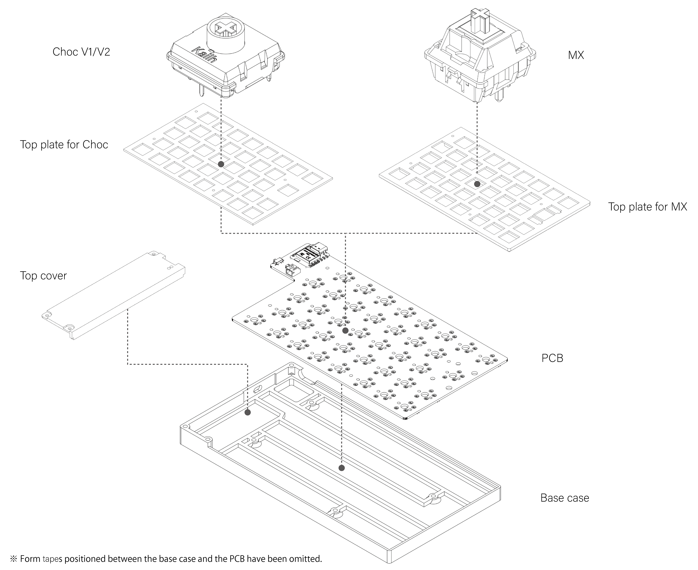
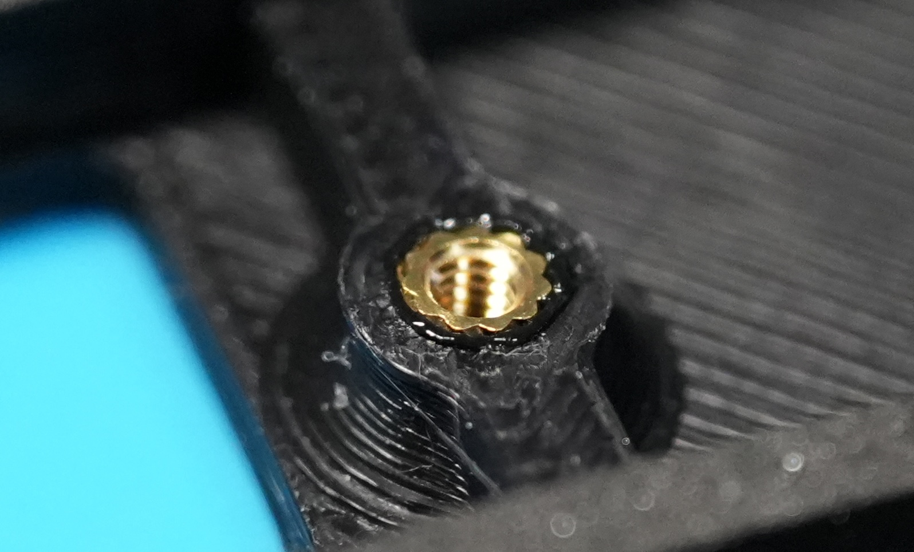
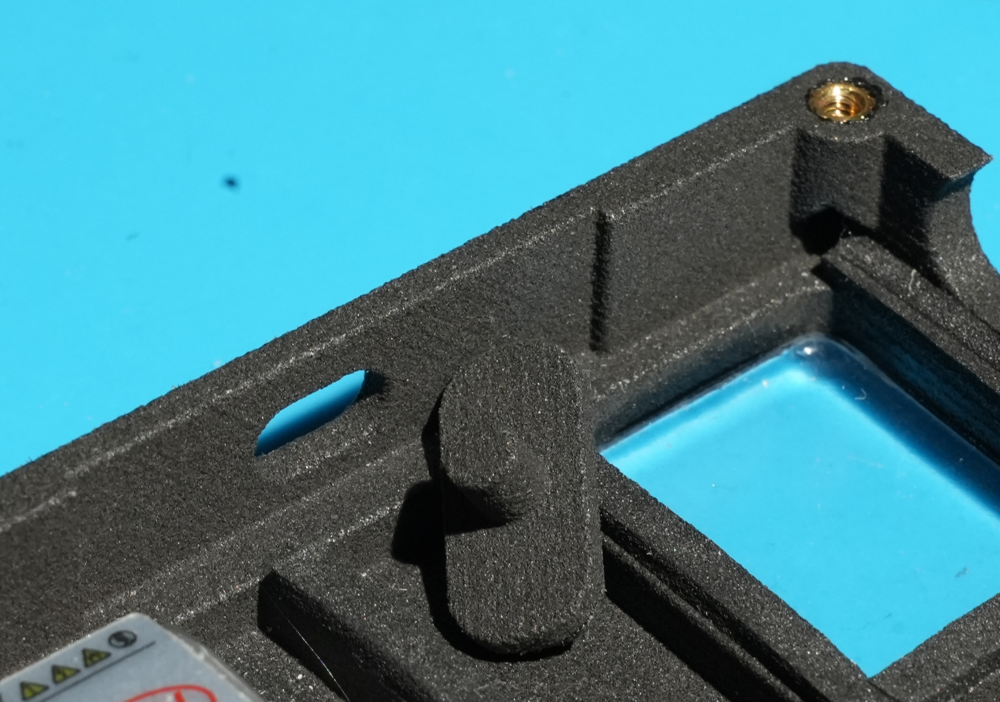
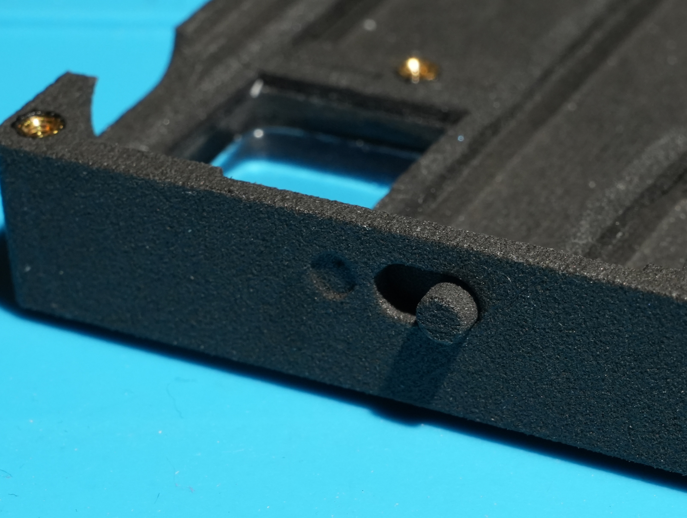
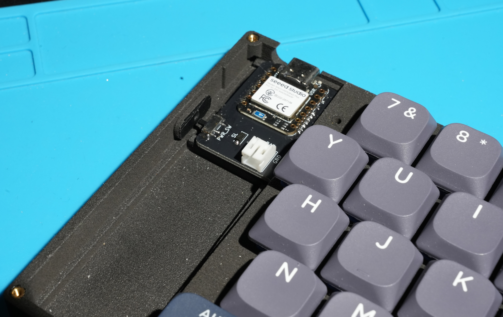
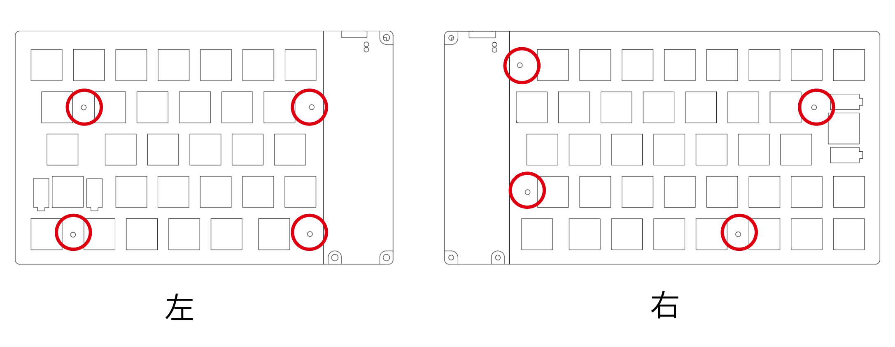
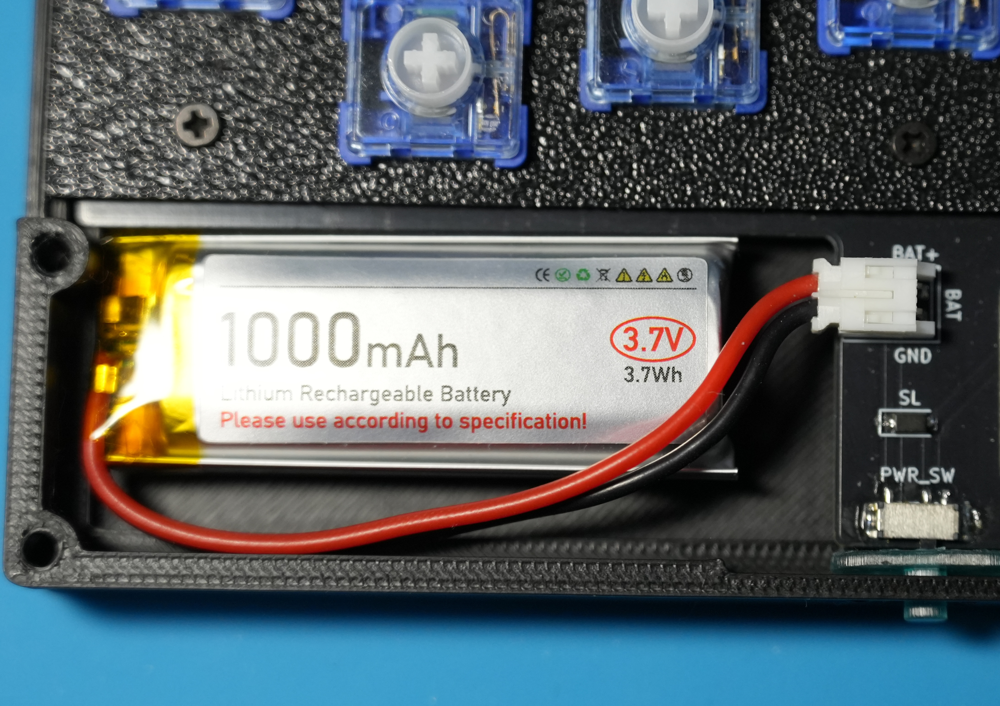
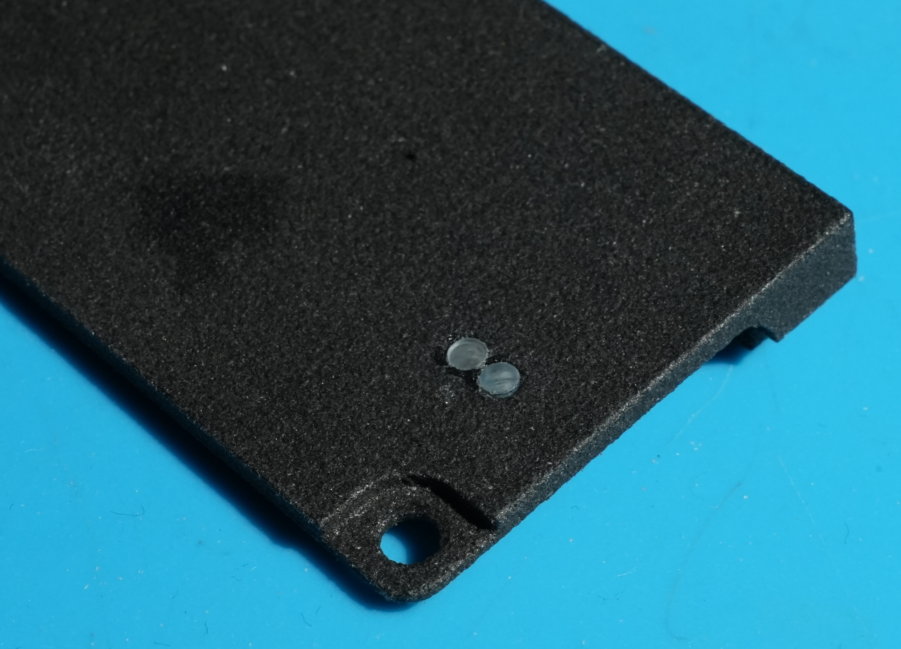
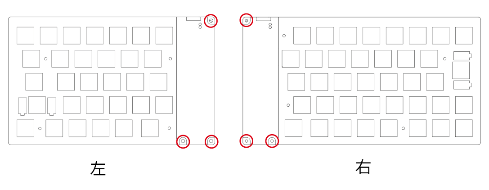
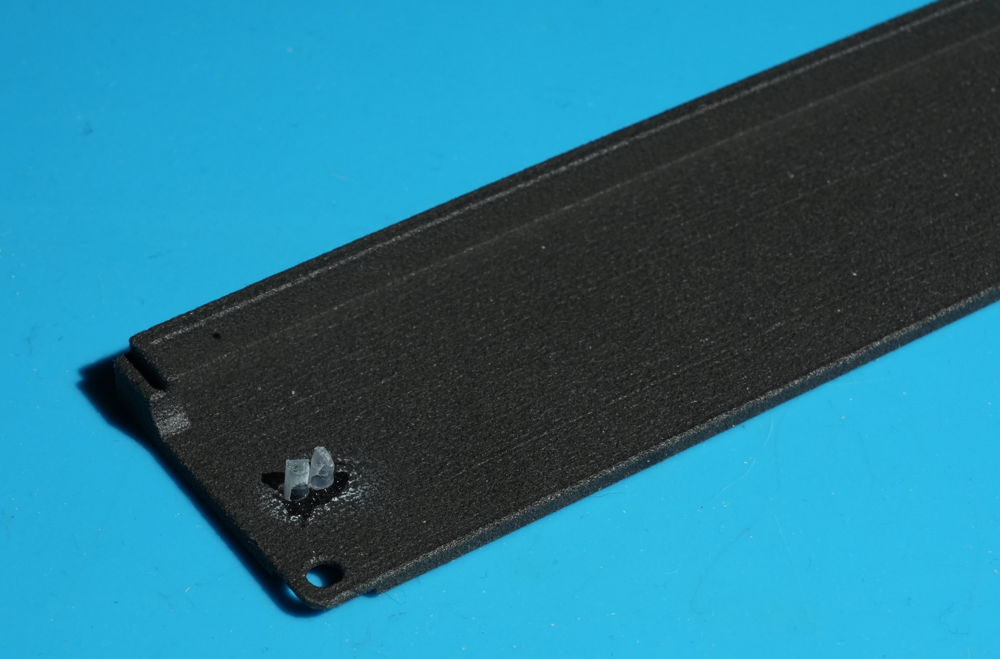

# Cleave HHJP ケースビルドガイド

[目次に戻る](README.md)

配布されているデフォルトケースの3Dモデルを使用して、Cleave HHJP のケースを作成する方法について説明します。

## 目次

- [ケースの選択肢](#ケースの選択肢)
- [デフォルトケースの構成](#デフォルトケースの構成)
- [用意するもの](#用意するもの)
- [ケース組み立て手順](#ケース組み立て手順)
- [参考: 完成状態](#参考-完成状態)

## ケースの選択肢

Cleave HHJP のケースを作る方法は大きく分けて2つあります。

1. 配布されているデフォルトケースの3Dモデルを使用する  
   自分で3Dプリントする、またはJLC3DPなどの3Dプリントサービスに発注して作成します。
2. PCBのSTEPファイルを使用してオリジナルケースを設計する  
   ユーザー自身でケースを設計し、好みの構造や素材に合わせて作成します。

このガイドでは、1つ目の「配布されているデフォルトケースの3Dモデルを使用する」方法を説明します。

## デフォルトケースの構成

デフォルトケースは、ベースケース（Base case）、PCB、トッププレート、トップカバー、キースイッチなどを組み合わせて作成します。

## 用意するもの

配布されているケースの3Dモデルを使用してケースを作成する場合は、以下の部品を用意します。

### ケース組み立て前の状態確認

標準ルートでは、先に基板単体でファームウェア書き込みと動作確認を行ってからケースを組み立てます。ケースなしの状態は動作確認用です。常用する場合は、このガイドに沿ってケースへ組み込んでください。

| 現在の状態 | 進め方 |
|---|---|
| キースイッチを基板単体での動作確認準備として仮取り付けしている | いったんスイッチを外し、このガイドの「4. キースイッチ取り付け」でトッププレートと一緒に取り付け直します。 |
| バッテリーを基板単体での動作確認準備として接続している | ケースへ組み込む前にいったんバッテリーを外し、このガイドの「8. バッテリーの固定」で接続し直して収まりと固定を確認します。 |
| キースイッチやバッテリーをまだ取り付けていない | このガイドの手順に沿って、キースイッチ取り付けとバッテリー固定を行います。 |

### 3Dプリント部品

配布されているデフォルトケースの3Dモデルから、ケース組み立てに必要な3Dプリント部品一式を用意します。印刷する部品の詳細は「1. 3D プリント部品の準備」で確認します。

### 3Dプリント部品以外で用意する部材

3Dプリントしたケース部品に加えて、以下の部材も必要になります。

|役割|部品名|数量|キット付属|備考|
|---|---|---|---|---|
|インサートナット|M2xL3xOD3.2|14個|○||
|ネジ|M2 8mm|8本|○|Chocトッププレート用|
|ネジ|M2 10mm|8本|○|MXトッププレート用|
|ネジ|M2 4mm|6本|○|トップカバー用|
|インジケーターランプ|直径2mm透明プラ棒（3mm程度）|4本|○|インジケーター穴ありトップカバーを使う場合に使用。穴なしまたは透明トップカバーを使う場合は不要|
|フォームテープ|フォームテープ2mm厚/3mm幅|2m程度||幅広のテープをカットして使う事も可能です。|
|滑り止めシート|ポロンシートなど|||任意|

## ケース組み立て手順

> [!NOTE]
> **左右両方で作業してください**
>
> このガイドでは写真や説明が片側のみの場合がありますが、特に記載がない限り、同じ手順を左用・右用の両方で行ってください。

### 1. 3D プリント部品の準備
配布されている3Dモデルを使い、ケース組み立てに必要な部品を用意します。モデル名やフォルダー構成は配布時点の内容に従い、印刷前に以下の構成を決めてください。

**印刷前に決めること**

- **使用するキースイッチの種類**：MX互換スイッチ、またはChocV1/V2互換スイッチを選びます。選択したスイッチに合わせてトッププレートを選び、固定にはMX用でM2 10mm、Choc用でM2 8mmのネジを使用します。
- **トップカバーのタイプ**：インジケーター穴あり、または穴なしを選びます。穴ありを選んだ場合は「9. インジケーターの取り付け」で透明プラ棒を取り付けます。穴なしを選んだ場合、その工程は実施不要です。

**印刷する部品**

|部品|モデルファイル|必要数|選択条件|
|---|---|---|---|
|左ベースケース|[base_case_left.stl](../models/base_case_left.stl)|1個|必須|
|右ベースケース|[base_case_right.stl](../models/base_case_right.stl)|1個|必須|
|電源スイッチノブ|[power_switch_knob.stl](../models/power_switch_knob.stl)|**2個**|必須|
|左トップカバー|[top_cover_left.stl](../models/top_cover_left.stl)|1個|インジケーター穴ありを選択する場合|
|右トップカバー|[top_cover_right.stl](../models/top_cover_right.stl)|1個|インジケーター穴ありを選択する場合|
|左トップカバー|[top_cover_left_no_indicator_hole.stl](../models/top_cover_left_no_indicator_hole.stl)|1個|穴なし。透明樹脂などを使用する場合|
|右トップカバー|[top_cover_right_no_indicator_hole.stl](../models/top_cover_right_no_indicator_hole.stl)|1個|穴なし。透明樹脂などを使用する場合|
|左MXトッププレート|[top_plate_mx_left.stl](../models/top_plate_mx_left.stl)|1枚|MX互換スイッチを使用する場合|
|右MXトッププレート|[top_plate_mx_right.stl](../models/top_plate_mx_right.stl)|1枚|MX互換スイッチを使用する場合|
|左Chocトッププレート|[top_plate_choc_left.stl](../models/top_plate_choc_left.stl)|1枚|ChocV1/V2互換スイッチを使用する場合|
|右Chocトッププレート|[top_plate_choc_right.stl](../models/top_plate_choc_right.stl)|1枚|ChocV1/V2互換スイッチを使用する場合|

上の表から、決めた構成に対応するモデルを選んで3Dプリントします。

**ベースケース素材の選び方**

左右のベースケースは「2. インサートナットの取り付け」でインサートナットをはんだごてで熱圧入します。熱圧入時に素材が適度に軟化し、冷えたあとにインサートナットを保持できる必要があるため、ベースケースには熱可塑性樹脂を選びます。JLCPCBで発注する場合は、以下の印刷方法と材料が熱可塑性樹脂として使えます。

|印刷方法|材料|
|---|---|
|MJF|PA12-HP Nylon|
|MJF|PAC-HP Nylon|
|MJF|PA11-HP Nylon|
|SLS|3301PA Nylon|
|SLS|3201PA-F Nylon|
|SLS|1172 Pro Nylon|
|FDM|PLA Plastic|
|FDM|ABS Plastic|
|FDM|ASA Plastic|
|FDM|PA12-CF Plastic（カーボンファイバー入りPA12）|
|FDM|TPU（実用的には非推奨）|

> [!TIP]
> 左右のベースケース素材はPA12-HP Nylonが強度と仕上がりのバランスがよくおすすめですが、ほかの候補と比べるとやや高めです。
> トッププレート、トップカバー、電源スイッチノブは、見た目や加工方法に合わせて選んで構いません。透明や半透明のトップカバーは、内部のバッテリーやマイコンを見せたい場合に向いています。

> [!NOTE]
> ベースケースは薄く広い構造上、多少の反りが発生することがありますが、PCBをネジ止めすることにより矯正できる場合がほとんどです。気になる場合はドライヤーなどで加熱することで多少の矯正効果が期待できます。

ベースケース以外のトップカバー、電源スイッチノブ、トッププレートはインサートナットを熱圧入しないため、SLA（レジン）やアクリルなど、見た目や加工方法に合わせて自由に選んで構いません。
> [!TIP]
> トップカバーを8001レジン（透明や半透明）で印刷するとバッテリーやマイコンが透けて見えてかっこよさを演出できます。

**造形後の確認**

- ねじ穴、インサートナット穴、スイッチ穴、電源スイッチノブの摺動部、トップカバーのインジケーター穴にサポート材や粉が残っている場合は、組み立て前に取り除きます。

**完了チェック**

- [ ] 使用するキースイッチの種類（MX / Choc）を決めた
- [ ] トップカバーのタイプ（インジケーター穴あり / 穴なし）を決めた
- [ ] 左右のベースケースを熱可塑性樹脂で用意した
- [ ] 左右のトップカバーを、選択したタイプで用意した
- [ ] 左右の電源スイッチノブを用意した
- [ ] 使用するキースイッチに対応した左右のトッププレートを用意した
- [ ] ねじ穴、インサートナット穴、スイッチ穴、電源スイッチノブの摺動部に造形残りがない
- [ ] （インジケーター穴ありトップカバーの場合）左右のトップカバーにインジケーター穴が開いている

### 2. インサートナットの取り付け
左右7箇所にインサートナットをはんだごてで熱圧入します。
ナットの上面とケースの上面が揃うところまで押し込みます。

**完了チェック**

- [ ] 左右それぞれ7箇所にインサートナットを取り付けた
- [ ] インサートナットの上面がケースの上面から大きく飛び出していない
- [ ] インサートナットが傾いていない
- [ ] ネジを軽く入れて、無理なく回ることを確認した

### 3. フォームテープの貼り付け
インサートナットを避けてベースケースの梁の部分にフォームテープを貼ります。

**完了チェック**

- [ ] フォームテープがケース内側の梁に沿って貼られている
- [ ] インサートナットやネジ穴をフォームテープで塞いでいない

### 4. キースイッチ取り付け
取り付け前に、使用するキースイッチに合ったトッププレートを用意していることを確認してください。MX互換スイッチとChocV1/V2互換スイッチでは、使用するトッププレートが異なります。
MX互換スイッチで2Uキーを使用する場合は、この工程でPCBマウント2Uスタビライザーも取り付けます。スタビライザーを取り付ける位置は、使用するキーキャップ構成に合わせて確認してください。

**完了チェック**

- [ ] 使用するキースイッチに合ったトッププレートを用意した
- [ ] スイッチのピンが曲がらず、PCBのソケットに入っている
- [ ] （スタビライザーを使う場合）2Uスタビライザーを取り付けた
- [ ] スイッチがトッププレートにまっすぐ収まっている

### 5. トッププレートの取り付け
PCBにスイッチを差し込みながらサンドイッチします。

**完了チェック**

- [ ] スイッチがトッププレートとPCBの両方に正しく入っている
- [ ] トッププレートが大きく反っていない
- [ ] ネジ穴の位置がPCB、トッププレート、ベースケースで合っている

### 6. 電源スイッチノブの取り付け
ケースの内側から電源スイッチノブを差し込みます。

| 電源スイッチノブをケースの裏側から通して→ | ケースの外側にノブを出す |
|---|---|
|  |  |

**完了チェック**

- [ ] 電源スイッチノブがケース外側へ出ている
- [ ] ノブが引っかからず左右に動く
- [ ] PCBを取り付けたときに、基板上の電源スイッチとノブが噛み合う向きになっている

### 7. PCBの取り付け
ベースケースにPCBとトッププレートとキースイッチが一体になった部品を装着します。
電源スイッチの窪みにPCBの電源スイッチのノブが刺さるようにスライドさせながらはめ込みます。

トッププレートのフチがベースケースにぴったり合うように調整し、左右それぞれ4箇所を 長さ8(Choc)/10(MX)mmのM2ネジで止めます。

**完了チェック**

- [ ] PCB、トッププレート、キースイッチがベースケースに収まっている
- [ ] 電源スイッチノブで基板上の電源スイッチを操作できる
- [ ] トッププレートのフチがベースケースに沿っている
- [ ] 左右それぞれ4箇所を、使用するトッププレートに合った長さのM2ネジで固定した
- [ ] ネジを締めすぎてケースやトッププレートが変形していない

### 8. バッテリーの固定
基板単体での動作確認時にバッテリーを接続していた場合は、ケースへ組み込む前にいったん外します。
バッテリーをコネクタに差し込み直してバッテリー用のスペースに格納します。
バッテリーが振動などで破損しないように、バッテリー裏面を両面テープなどでケースに固定することを強く推奨します。

|シルクスクリーンの印刷|極性|
|---|---|
|BAT+|正極（赤色のケーブル）|
|GND|負極（黒色のケーブル）|

> [!CAUTION]
> LiPoバッテリーはショートや強い曲げ、穴あき、圧迫で発熱・発火する可能性があります。接続作業中はUSBケーブルを抜き、電源スイッチをOFFにします。赤黒のリード線やコネクタ端子を金属工具で同時に触れないでください。
> バッテリーの極性を間違えて接続するとマイコンが壊れて修復不能になる場合があります。バッテリーやケーブルがネジ穴、トップカバー、PCBに挟まれないことも確認してください。

**完了チェック**

- [ ] バッテリーコネクタが奥まで差し込まれている
- [ ] `BAT+`に赤色のケーブル、`GND`に黒色のケーブルが接続されている
- [ ] バッテリーがケース内のスペースに収まっている
- [ ] バッテリーやケーブルがネジ穴、トップカバー、PCBに挟まれない
- [ ] バッテリーがケース内で動かないように固定されている

### 9. インジケーターの取り付け
> [!NOTE]
> インジケーター穴ありトップカバーを使う場合のみ行います。穴なしトップカバーを使う場合は、このステップは実施不要です。
直径2mm透明プラ棒（3mm程度）をトップカバーに差し込みます。
接着はまだしません。

**完了チェック**

- [ ] （インジケーター穴ありトップカバーの場合）透明プラ棒を左右それぞれ必要な位置に差し込んだ

### 10. トップカバーの取り付け
トップカバーをベースケースに3箇所 4mmのM2ネジ止めします。

インジケーターを付けた場合はここでPCBとインジケーターの隙間を調整し、上面に出ている不要な分はニッパーなどで切って調整したあとに接着剤などを使ってカバーの側から接着してください。

**完了チェック**

- [ ] トップカバーを左右それぞれ3箇所のM2 4mmネジで固定した
- [ ] トップカバーが浮かず、ベースケースに沿っている
- [ ] （インジケーターありの場合）透明プラ棒の長さを調整して固定した
- [ ] 電源スイッチノブがトップカバーと干渉せずに動く

### 11. キーキャップの取り付け
用意したキーキャップをスイッチに装着します。

**完了チェック**

- [ ] すべてのキースイッチにキーキャップを取り付けた
- [ ] キーキャップが隣のキーやケースに干渉していない
- [ ] （スタビライザーを使う場合）スタビライザーを使うキーが傾かずに押せる

### 12. 滑り止めの取り付け（任意）
3Dプリントしたケースや使うデスクの材質によってはキーボードが滑る事があるので、お好みに応じてケースの裏側に両面テープなどでポロンシートやすべり止めシートを貼り付けます。

**完了チェック**

- [ ] （任意）左右のケース裏面に滑り止めを貼り付けた
- [ ] （任意）滑り止めが机に接地している
- [ ] （任意）キーボードを置いたときにがたつきがない

## 参考: 完成状態
ケースの組み立てが完了すると、以下のような状態になります。写真はChocキースイッチとChoc用キーキャップを使用した例です。

## ステップの完了
ついにキーボードが完成しました。
次のガイドではこのキーボードの使い方を確認しましょう。
- [次: 完成後の使い方](04-USAGE.md)
- [目次に戻る](README.md)
