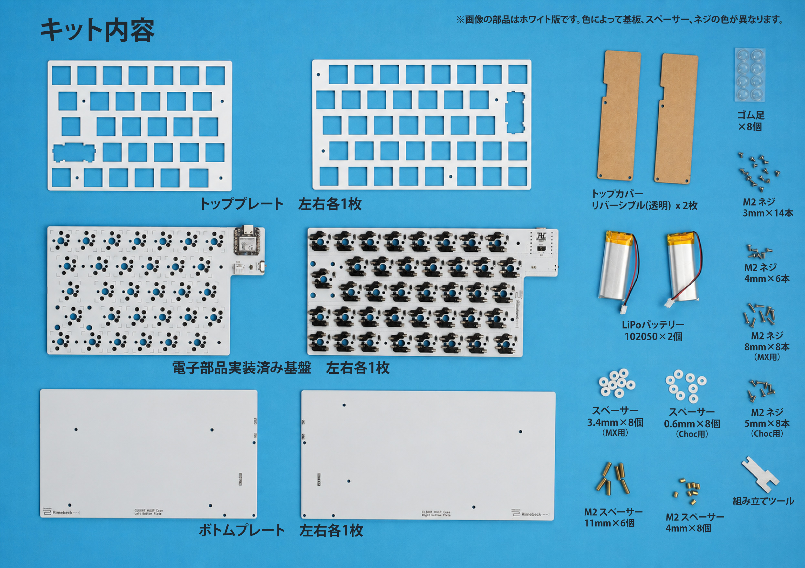
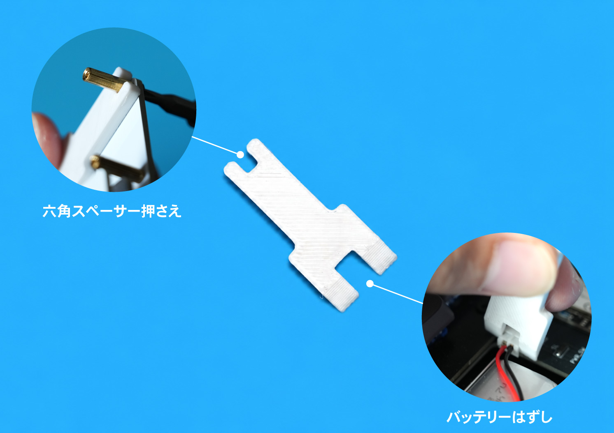

# CLEAVE HHJP お手軽キット組み立てガイド

[目次に戻る](README.md)

お手軽キットは、電子部品の実装とファームウェアの書き込みが完了した状態で届きます。このガイドでは、付属のケースへ基板を組み込みます。

## 目次

- [キット内容](#キット内容)
- [ケースの構成](#ケースの構成)
- [ケース組み立て前の状態確認](#ケース組み立て前の状態確認)
- [ケース組み立て手順](#ケース組み立て手順)
- [参考: 完成状態](#参考-完成状態)

## キット内容

部品一覧の画像はホワイト版です。基板、スペーサー、ネジなどは色違いの場合があります。

### キットに含まれるもの

| 部品名 | 数量 | 備考 |
|---|---:|---|
| 電子部品実装済み基板 | 左右各1枚 | ファームウェア書き込み・基板単体動作確認済み |
| トッププレート | 左右各1枚 | MX/Choc共通 |
| ボトムプレート | 左右各1枚 |  |
| トップカバー | 2枚 | リバーシブル、透明 |
| LiPoバッテリー 102050 | 2個 |  |
| M2スペーサー 4mm | 8個 | ボトムプレートと基板の固定用 |
| M2スペーサー 11mm | 6個 | ボトムプレートとトップカバーの固定用 |
| スペーサー 3.4mm | 8個 | MXスイッチ使用時 |
| スペーサー 0.6mm | 8個 | Chocスイッチ使用時 |
| M2 3mmネジ | 14本 |  |
| M2 4mmネジ | 6本 | トップカバー固定用 |
| M2 8mmネジ | 8本 | MXスイッチ使用時 |
| M2 5mmネジ | 8本 | Chocスイッチ使用時 |
| ゴム足 | 8個 |  |
| 組み立てツール | 1個 | 六角スペーサー押さえ・バッテリーコネクタ外し |

### 組み立てツールの使い方

付属の組み立てツールは、六角スペーサーの固定とバッテリーコネクタの取り外しに使用します。

- **六角スペーサー押さえ**：ネジを締める際に六角スペーサーを挟み、空回りしないように押さえます。

> [!IMPORTANT]
> 組み立てツールは、六角スペーサーを回すためのスパナではありません。ツールでスペーサーを押さえ、反対側のM2ネジをプラス精密ドライバーで締めてください。ツールは樹脂製のため、スパナのように回してトルクをかけると溝が広がり、スペーサーを保持できなくなるおそれがあります。

- **バッテリーコネクタ外し**：ツールをコネクタのハウジングに掛け、基板に対してまっすぐ引き抜きます。ケーブルを持って引っ張らないでください。

### 別途用意するもの

| 必要性 | 部品・道具 | 数量 | 備考 |
|---|---|---:|---|
| 必須 | 両面テープ | 適量 | スペーサーとバッテリーの固定用 |
| 必須 | お好みのMXまたはChocキースイッチ | 70個 |  |
| 必須 | お好みのMXまたはChocキーキャップ | 70個分 | JIS配列 |
| 必須 | プラス精密ドライバー | 1本 |  |
| 任意 | ピンセット | 1本 | 両面テープの貼り付けに使用 |

## ケースの構成

ケースは、ボトムプレートとトッププレートでPCBを挟み込む「サンドイッチ構造」です。加えてトップカバーなどを組み合わせて作成します。

## ケース組み立て前の状態確認

お手軽キットは、基板の電子部品実装、ファームウェア書き込み、基板単体での動作確認が完了しています。ケース組み立てを始める前に、以下を確認してください。

- USBケーブルを基板から外している
- 左右の電源スイッチがOFFになっている
- 左右の基板、ケース部品、キースイッチ、キーキャップが揃っている
- バッテリーはケースへ固定するまで接続しない

## ケース組み立て手順

> [!NOTE]
> **左右両方で作業してください**
>
> このガイドでは写真が左側のみ掲載されている場合がありますが、特に記載がない限り、同じ手順を左右の両方で行ってください。

### 1. ケース部品の確認

「キット内容」に記載したケース部品、ネジ、スペーサー、別途用意したキースイッチ、両面テープ、工具が揃っていることを確認します。

MXスイッチを使用する場合は3.4mmスペーサーとM2 8mmネジ、Chocスイッチを使用する場合は0.6mmスペーサーとM2 5mmネジを使用します。

**完了チェック**

- [ ] ケース組み立てに必要な部品・道具をすべて用意した
- [ ] 使用するスイッチに合ったスペーサーとネジを確認した

### 2. スペーサーネジの取り付け

ボトムプレートの印字がされている面に、M2スペーサー 4mmとM2スペーサー 11mmを配置し、それぞれ裏面からM2 3mmネジで固定します。
4mmと11mmの取り付け位置は下図を参考にしてください。

緑色：4mm / オレンジ色：11mm

#### 右側

#### 左側

このステップが完了すると以下のようになります。

**完了チェック**

- [ ] 4mmスペーサーを全8箇所取り付けた
- [ ] 11mmスペーサーを全6箇所取り付けた

### 3. スペーサーの取り付け

トッププレートの裏面（文字が印字してある面）に、使用するスイッチに合ったスペーサーを取り付けます。

- MX互換スイッチ：3.4mmスペーサー
- ChocV1/V2互換スイッチ：0.6mmスペーサー

ネジ穴を塞がないように両面テープでトッププレートとスペーサーを貼り付けます。穴とスペーサーにネジを通して位置決めすると、正確に貼り付けられます。

> [!NOTE]
> 画像はわかりやすいようにトッププレートとスペーサーの色を変えていますが、実際にはトッププレートと同系色のスペーサーが付属します。

**完了チェック**

- [ ] 使用するスイッチに応じたスペーサーを全8箇所取り付けた

### 4. キースイッチ取り付け

MX互換スイッチまたはChocV1/V2互換スイッチをトッププレートにはめ込みます。

PCBを確認しながら、スイッチの上下の向きに注意してください。

> [!NOTE]
> 右側エンターキーのみ、スタビライザー穴の都合上スイッチが保持されづらくなっています。そのスイッチのみ次のステップで取り付けても問題ありません。

**完了チェック**

- [ ] 70個のスイッチがトッププレートにはまっている
- [ ] スイッチの向きが正しい

### 5. トッププレートの取り付け

MXスタビライザーを使う場合は、このタイミングでPCBへ取り付けます。トッププレートやPCBと干渉しないことを確認しながら、PCBの左右それぞれにスタビライザーをはめ込みます。

PCBにスイッチを差し込みながらトッププレートとPCBを組み合わせます。一気に差し込まず、端のスイッチから徐々にソケットへ差し込んでください。スペーサーがずれないように注意します。

> [!NOTE]
> Chocスイッチを使用する場合、PCBとトッププレートの隙間が微小になりますが、接触することはありません。接触している場合は、スイッチがトッププレートに完全にはまっていない可能性があります。
>
> 参考画像：
> 

スイッチのピンが折れ曲がらないように注意します。PCBを裏返して、ソケットにピンが正常に差し込まれていることを確認します。

完了すると以下のようになります。

**完了チェック**

- [ ] スイッチがトッププレートとPCBの両方に正しく入っている
- [ ] スイッチのピンが曲がらず、PCBのソケットに入っている

### 6. PCBの取り付け

M2スペーサー 4mmを取り付けたボトムプレートに、PCB、トッププレート、キースイッチが一体になった部品を装着します。

- MX互換スイッチ：M2 8mmネジ
- ChocV1/V2互換スイッチ：M2 5mmネジ

トッププレートのネジ穴とボトムプレートの4mmスペーサーの位置を合わせ、左右それぞれ4箇所をトッププレート側からネジ止めします。組み立てツールは回さず、六角スペーサー押さえでスペーサーを固定したまま、反対側のM2ネジをプラス精密ドライバーで締めてください。

**完了チェック**

- [ ] 左右それぞれ4箇所を、使用するスイッチに合ったM2ネジで固定した
- [ ] ネジを締めすぎてケースやトッププレートが変形していない

### 7. バッテリーの固定

USBケーブルを抜き、電源スイッチがOFFになっていることを再確認します。LiPoバッテリーをコネクタに差し込み、ボトムプレートの「BATTERY」と記載された部分に両面テープで貼り付けます。

| シルクスクリーンの印刷 | 極性 |
|---|---|
| BAT+ | 正極（赤色のケーブル） |
| GND | 負極（黒色のケーブル） |

> [!CAUTION]
> LiPoバッテリーはショートや強い曲げ、穴あき、圧迫で発熱・発火する可能性があります。赤黒のリード線やコネクタ端子を金属工具で同時に触れないでください。バッテリーやケーブルがネジ穴、トップカバー、PCBに挟まれないことも確認してください。

**完了チェック**

- [ ] バッテリーコネクタが奥まで差し込まれている
- [ ] `BAT+`に赤色のケーブル、`GND`に黒色のケーブルが接続されている
- [ ] バッテリーがケース内のスペースに収まっている
- [ ] バッテリーやケーブルがトップカバー、PCBなどに挟まれない
- [ ] バッテリーがケース内で動かないように固定されている

### 8. トップカバーの取り付け

トップカバーの裏表の保護フィルムを剥がし、透明な状態にします。左右それぞれ3箇所をM2 4mmネジで固定します。

組み立てツールは回さず、六角スペーサー押さえでスペーサーを固定したまま、反対側のM2ネジをプラス精密ドライバーで締めてください。

> [!NOTE]
> トップカバーはリバーシブルです。左右どちらにも同じトップカバーを裏返して取り付けられます。

**完了チェック**

- [ ] トップカバーを左右それぞれ3箇所のM2 4mmネジで固定した

### 9. ゴム足の取り付け

本体を裏返して、ボトムプレートの四隅にゴム足を貼り付けます。ネジを避けて貼り付けてください。

キーボードに傾斜を付けたい場合は、奥側のみに貼り付けることもできます。

**完了チェック**

- [ ] ゴム足を貼り、キーボードを置いたときにがたつきがない

## 参考: 完成状態

ケースの組み立てが完了すると、以下のような状態になります。お好みのキーキャップを取り付ければ使用準備は完了です。

## ステップの完了

お手軽キットの組み立てが完了しました。次のガイドでキーボードの使い方を確認してください。

- [次: 完成後の使い方](04-USAGE.md)
- [目次に戻る](README.md)
