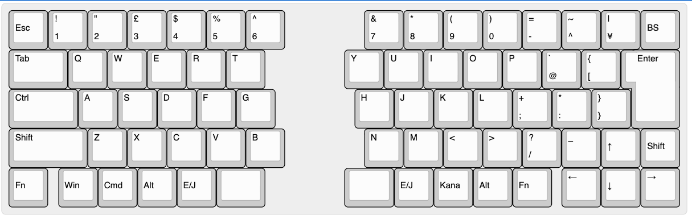

# Cleave HHJP 完成後の使い方

[目次に戻る](README.md)

## 目次

- [組み立て完了後の動作確認](#組み立て完了後の動作確認)
- [基本操作](#基本操作)
- [ChocとMXを相互に交換する方法](#chocとmxを相互に交換する方法)
- [Bluetooth 接続](#bluetooth-接続)
- [充電](#充電)
- [キーマップ変更](#キーマップ変更)
- [持ち運び用ポーチ](#持ち運び用ポーチ)

## 組み立て完了後の動作確認

ケースまで組み立てたら、使用を始める前に以下を確認します。
基板単体での確認はファームウェア書き込み時に行っているため、ここではケース組み立て後の最終確認を行います。

- [ ] 左右の電源スイッチをONにすると、左右それぞれのXIAO nRF52840 Plusが起動する
- [ ] PCのBluetooth設定に`Cleave HHJP`が表示される
- [ ] `Cleave HHJP`へBluetooth接続できる
- [ ] 左右のキーがどちらも入力できる
- [ ] USBケーブルを接続すると、充電LEDの表示を確認できる
- [ ] 充電中は充電LEDが赤色、充電完了時は緑色になる

### うまくいかない場合

| 症状 | 確認すること |
|---|---|
| PCのBluetooth設定に`Cleave HHJP`が表示されない | [ファームウェアガイドの「Bluetoothに表示されない」](02-FIRMWARE.md#bluetoothに表示されない)を確認します。 |
| `Cleave HHJP`へBluetooth接続できない | OS側の登録を削除してから、[ペアリングリセット](#ペアリングリセット)を行います。 |
| 左右どちらかのキーが入力できない | [ファームウェアガイドの「左右が接続しない」](02-FIRMWARE.md#左右が接続しない)を確認します。 |
| 一部のキーだけ反応しない | [ファームウェアガイドの「一部のキーが反応しない」](02-FIRMWARE.md#一部のキーが反応しない)を確認します。 |
| 充電LEDが点灯しない | USBケーブル、USBポート、[ケースガイドのバッテリー固定](03-CASE.md#8-バッテリーの固定)を確認します。 |

> [!NOTE]
> Cleave HHJPは通常利用をBluetooth接続で行います。USB接続は、ファームウェア更新、充電、ZMK Studioでの設定変更に使用します。

## 基本操作

### デフォルトキーマップ

初期状態のキー割り当てはHHKBと同じ以下の通りです。

### 電源スイッチ

左右のケース側面にある電源スイッチで、左右それぞれの電源をON/OFFします。キーボードとして使用する場合は、左右両方の電源をONにします。
電源スイッチをOFFにすると、その側のキーボード動作は停止します。USB Type-Cケーブル経由で給電している場合は、電源スイッチがOFFでも充電・動作できます。

### USB 接続時の挙動

USB接続は以下の用途で使用します。

- ファームウェアの書き込み
- 充電
- ZMK Studioでのキーマップ変更（詳細は[カスタマイズガイド](05-CUSTOMIZE.md)を参照）

通常のキー入力はBluetooth接続で行います。ZMK Studioを使用する場合は、左側キーボードをUSB接続します。

## ChocとMXを相互に交換する方法

Cleave HHJPは、MX互換スイッチとChocV1/V2互換スイッチの両方のホットスワップソケットを実装している場合、スイッチとトッププレートを交換して相互に切り替えられます。交換先のスイッチに合ったトッププレート、キーキャップ、トッププレート固定ネジを用意してください。トッププレート固定ネジは、ChocトッププレートではM2 8mm、MXトッププレートではM2 10mmを使用します。スイッチ種別の変更だけであれば、ファームウェアの書き換えは不要です。

> [!NOTE]
> 完成後にChocとMXを交換する場合は、基板単体確認用の仮取り付けではなく、ケースビルドガイドの[4. キースイッチ取り付け](03-CASE.md#4-キースイッチ取り付け)からやり直します。交換先のトッププレートにスイッチをはめ込んでから、PCBとサンドイッチしてください。

### 用意するもの

- 交換先のスイッチに対応した左右のトッププレート
- 交換先のスイッチとキーキャップ
- Chocトッププレート用のM2 8mmネジ、またはMXトッププレート用のM2 10mmネジ
- キーキャッププラー、ドライバーなど分解に使う工具

### 交換手順

1. 左右の電源スイッチをOFFにし、USB Type-Cケーブルを抜きます。
2. キーキャップを外します。
3. ケースビルドガイドの[10. トップカバーの取り付け](03-CASE.md#10-トップカバーの取り付け)を参考に、トップカバーのM2 4mmネジを外してトップカバーを外します。
4. バッテリーコネクタを基板から外します。固定テープを一時的に剥がす必要がある場合は、バッテリー本体やリード線に無理な力をかけないように慎重に作業します。
5. トッププレートを固定している4箇所のM2ネジを外し、PCB、トッププレート、キースイッチが一体になった部品をベースケースから慎重に取り出します。ケーブルを引っ掛けないように注意してください。
6. 古いスイッチとトッププレートを外します。スイッチのピンを曲げないように、無理にこじらずまっすぐ外してください。
7. 交換先のトッププレートに交換先のスイッチをはめ込みます。ここからはケースビルドガイドの[4. キースイッチ取り付け](03-CASE.md#4-キースイッチ取り付け)から進めます。
8. 続けて[5. トッププレートの取り付け](03-CASE.md#5-トッププレートの取り付け)、[7. PCBの取り付け](03-CASE.md#7-pcbの取り付け)、[8. バッテリーの固定](03-CASE.md#8-バッテリーの固定)、[10. トップカバーの取り付け](03-CASE.md#10-トップカバーの取り付け)、[11. キーキャップの取り付け](03-CASE.md#11-キーキャップの取り付け)を行います。
9. 組み直したあと、左右の電源をONにして、すべてのキーが入力できることを確認します。

**完了チェック**

- [ ] 交換先のスイッチに対応したトッププレートを使っている
- [ ] スイッチがトッププレートにまっすぐ収まっている
- [ ] スイッチのピンが曲がらず、対応するホットスワップソケットに入っている
- [ ] トッププレートを、Choc用はM2 8mm、MX用はM2 10mmのネジで固定した
- [ ] バッテリーコネクタを接続し直し、バッテリーやケーブルがケース内で挟まれていない
- [ ] キーキャップが隣のキーやケースに干渉していない
- [ ] 左右すべてのキーが入力できる

## Bluetooth 接続

左右の電源をONにすると、左右間の接続は自動で行われます。PCやタブレットなどのホスト機器には、Bluetooth設定から`Cleave HHJP`を選択して接続します。

### Bluetooth デバイス切り替え

Cleave HHJPは最大5つのBluetooth接続先を切り替えて使用できます。

接続先を切り替えるには、`Ctrl`を押しながら`Fn` + `1`〜`5`を押します。

| 操作 | 接続先 |
|---|---|
| `Ctrl` + `Fn` + `1` | Bluetoothプロファイル1 |
| `Ctrl` + `Fn` + `2` | Bluetoothプロファイル2 |
| `Ctrl` + `Fn` + `3` | Bluetoothプロファイル3 |
| `Ctrl` + `Fn` + `4` | Bluetoothプロファイル4 |
| `Ctrl` + `Fn` + `5` | Bluetoothプロファイル5 |

新しい機器とペアリングする場合は、空いているプロファイルに切り替えてから、接続先のBluetooth設定で`Cleave HHJP`を選択します。

### リセット方法の選び方

| やりたいこと | 使う方法 | 消えるもの | 参照先 |
|---|---|---|---|
| 接続先のPCやスマートフォンとのペアリングをやり直す | 現在のBluetoothプロファイルをクリアする（キーマップ上では`&bt BT_CLR`） | 選択中のBluetoothプロファイルに記録された接続先情報 | [ペアリングリセット](#ペアリングリセット) |
| 左右の接続や永続化設定を初期化して、初回書き込みからやり直す | `settings_reset`用ファームウェアを書き込む | キーボード本体に保存されたBluetoothやZMKの永続化設定 | [ファームウェアの書き込み](02-FIRMWARE.md#ファームウェアの書き込み) |
| ZMK Studioで保存したキーマップを初期状態に戻す | ZMK StudioのRestore Stock Settingsを実行する | ZMK Studioで保存したキーマップ設定 | [カスタマイズガイドのトラブルシューティング](05-CUSTOMIZE.md#ファームウェアを書き込んだのにキーマップが変わらない) |

### ペアリングリセット

接続先の機器を変更したい場合や、以前のペアリング情報が残っていて接続できない場合は、現在選択中のBluetoothプロファイルをリセットします。

1. リセットしたいBluetoothプロファイルに切り替えます。
2. `Ctrl`を押しながら`Fn` + `Backspace`を押します。
3. 接続先のOS側に残っている`Cleave HHJP`の登録を削除します。
4. もう一度Bluetooth設定から`Cleave HHJP`を選択してペアリングします。

複数のCleave HHJPを同時にセットアップする場合は、意図しない組み合わせで左右がペアリングされないように、1ペアずつ電源を入れて設定してください。

## 充電

### 充電方法

左右それぞれのXIAO nRF52840 PlusにUSB Type-Cケーブルを接続して充電します。左右のバッテリーは独立しているため、必要に応じて片側ずつ充電できます。

充電はXIAO nRF52840 Plusの充電ICによって自動で制御されます。電源スイッチがOFFの状態でも充電できます。

### 充電 LED の確認

充電状態はXIAO nRF52840 Plusの充電LEDで確認します。

| 充電LED | 状態 |
|---|---|
| 赤色 | 充電中 |
| 緑色 | 充電完了 |

充電LEDはキーボードの動作状態を示すLEDとは別のLEDです。USBケーブルを接続しても充電LEDが点灯しない場合は、ケーブル、USBポート、バッテリーコネクタの接続を確認してください。

## キーマップ変更

日常的なキー割り当ての変更は、左側キーボードをUSB接続してZMK Studioで行います。初期キーマップ、レイヤー構成、マクロ、Bluetooth設定などファームウェア側の定義を変更したい場合は、このリポジトリをフォークしてUF2ファイルをビルドします。

詳しい手順は、[Cleave HHJP カスタマイズガイド](05-CUSTOMIZE.md)を参照してください。

## 持ち運び用ポーチ

Choc版の持ち運び用ポーチとして、[エレコム トラベルポーチ BMA-F01XNV](https://amzn.asia/d/06oVbq20)がちょうどよく収まります。（MX版は高さが足りないため、このポーチには収納できません。）

- [次: Cleave HHJP カスタマイズガイド](05-CUSTOMIZE.md)
- [目次に戻る](README.md)
