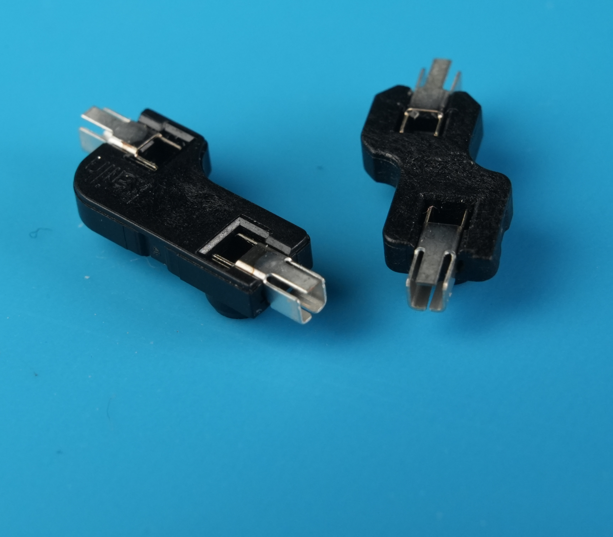
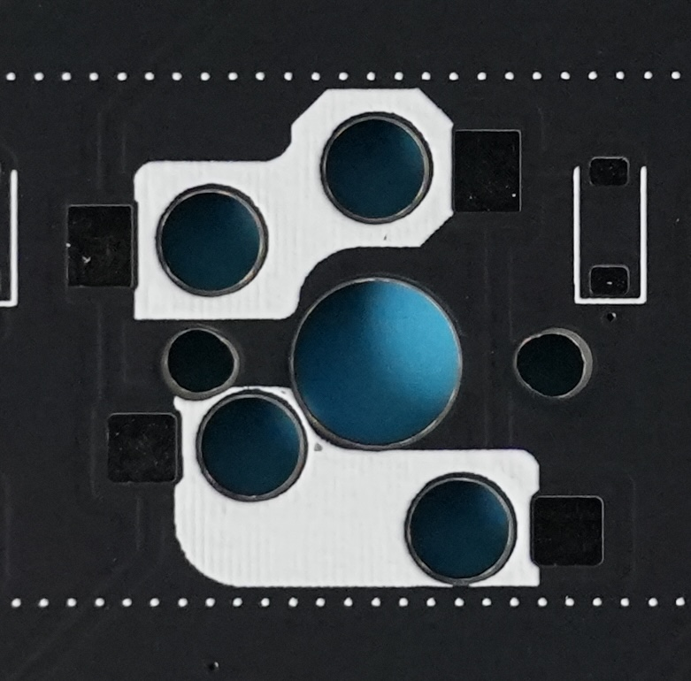
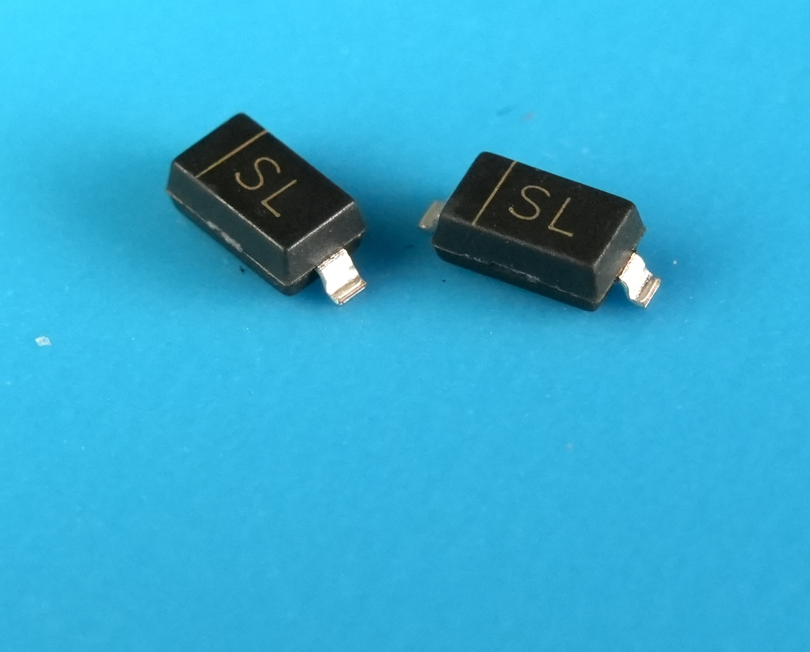
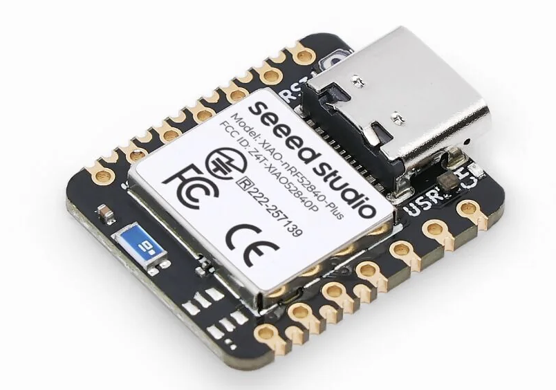
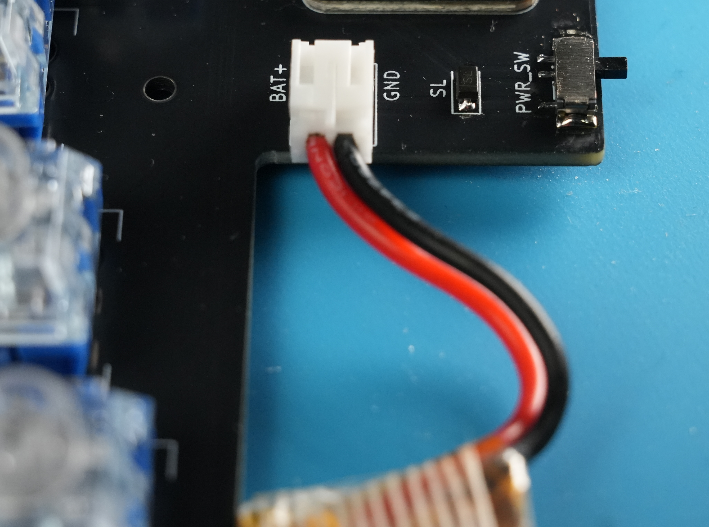

# Cleave HHJP ビルドガイド

> [!WARNING]
> Cleave HHJPを組み立てる際はこのビルドガイドをよく読んでから作業を開始してください。
> このビルドガイドを遵守しない場合、故障や事故の原因となる可能性があります。

## 目次

- [作業前の確認](#作業前の確認)
- [用意する道具](#用意する道具)
- [用意する部品](#用意する部品)
- [組み立て手順](#組み立て手順)
- [ファームウェアのダウンロード・書き込み・接続確認](FIRMWARE.md)
- [ケースビルドガイド](CASE.md)
- [完成後の使い方](USAGE.md)
- [トラブルシューティング](#トラブルシューティング)

## 作業前の確認

## 用意する道具
|部品名|説明|
|---|---|
|はんだごてセット|本キットははんだ付けが必要です。|
|先細ピンセット|小さいチップ部品を扱うために使用します。|
|マスキングテープ|スルーホールタイプの部品をはんだ付けする際の固定に使用します。|
|テスター|電気的な疎通テストを行うために使用します。必須ではありませんが、不具合が疑われる場合にあると便利です。|

## 用意する部品
Cleave HHJPをキーボードとして動作させるために最低限必要な部品は以下の通りです。
|役割|部品名|数量|キット付属|備考|
|---|---|---|---|---|
|基板|Cleave HHJP 基板 - 右|1|◯||
|基板|Cleave HHJP 基板 - 左|1|◯||
|電源スイッチ|MSK-12C02 2.5H|2|◯|純正のケースを使用する場合はノブが高い2.5Hを推奨|
|スイッチングダイオード|1N4148W (SOD-123)|70|◯|チップ表面に「T4」と表記があるもの|
|ショットキーバリアダイオード|B5819W (SOD-123)|2|◯|チップ表面に「SL」と表記があるもの|
|バッテリーコネクタ メス|JST PH 2ピン L字|2|◯||
|バッテリー|LiPoバッテリー|2||付属のケースで作成する場合は最大102050サイズまで対応|
|ボード|XIAO nRF52840 Plus|2||左右両側に1個ずつ。"Plus"が必要です。購入先例：[スイッチサイエンス](https://www.switch-science.com/products/10468)|

Cleave HHJPはMX互換のスイッチとChocV1/V2互換のスイッチの両方に対応しています。1つの基板に両方のホットスワップソケットを実装してスイッチとトッププレートを変えるだけで両方のスイッチに対応させることが可能です。
使用するスイッチのタイプに応じて、以下の部品も用意してください。

**MX互換スイッチを使用する場合**
|役割|部品名|数量|備考|
|---|---|---|---|
|ホットスワップソケット|CPG151101S11|70|
|キー|MX互換|70|
|スタビライザー|PCBマウント2U|2|任意|

**ChocV1/V2互換スイッチを使用する場合**
|役割|部品名|数量|備考|
|---|---|---|---|
|ホットスワップソケット|CPG135001S30|70|
|キー|ChocV1/V2|70|

配布されているケースの3Dモデルを使用してケースを作成する場合は、以下を参照してください。

[Cleave HHJP ケースビルドガイド](CASE.md)

## 組み立て手順

### 1. ホットスワップソケットのはんだ付け
基板のウラ面（Cleave HHJPのロゴが印刷されている方）を上にして置きます。
左右の基板それぞれにホットスワップ用のソケットをはんだ付けします。
- 右：39箇所
- 左：31箇所

MX/Choc両対応をする場合は両方、どちらかのみの場合は対応する片方にソケットを実装してください。

> [!NOTE] 
> **はんだ付けのコツ**
>
> はじめにどちらか一方のランドに予備はんだをし、それを溶かしながらソケットを載せます。ソケットとはんだが馴染んだらはんだごてを離し、残るもう片方のランドとソケットをはんだ付けします。

ソケットのはんだ付けが完了すると以下のような状態になります。（画像はMX/Choc両対応の例）

### 2. スイッチングダイオードのはんだ付け
左右の基板それぞれにスイッチングダイオード（チップ表面に「T4」と表記があるもの）をはんだ付けします。
- 右：39箇所
- 左：31箇所

> [!IMPORTANT]
> ダイオードには向きがあります。フットプリントのコの字に閉じている方をダイオードの線がついている方（カソード）に合わせます。

スイッチングダイオードのはんだ付けが完了すると以下のような状態になります。（画像はMX/Choc両ソケット対応の例）

#### 完了チェック

- [ ] 右39箇所、左31箇所にスイッチングダイオードを実装した
- [ ] すべてのダイオードの線がフットプリントのコの字側に合っている
- [ ] 浮いているダイオードや片側だけ未はんだの箇所がない
- [ ] 必要に応じてテスターで導通を確認した

これでウラ面の実装は完了しました。続いて基板を裏返しにしてオモテ面の実装をします。

### 3. 電源スイッチのはんだ付け
基板オモテ面の`PWR_SW`とシルクスクリーンが印刷されている箇所に電源スイッチ「MSK-12C02」を実装します。

位置合わせ用の穴が2つ空いているので、それに合わせて3つのピンをはんだ付けします。
固定できたらスイッチ両脇にある固定用のはんだパッドもはんだ付けして固定します。

> [!NOTE]
> 左右の基板で向かい合うようにどちらもはんだ付けします。

電源スイッチのはんだ付けが完了すると以下のような状態になります。

### 4. ショットキーダイオードのはんだ付け
バッテリー充電の逆流防止ダイオード（チップ表面に「SL」と表記があるもの）を実装します。

> [!IMPORTANT]
> ダイオードには向きがあります。
> フットプリントのコの字に閉じている方をダイオードの線がついている方（カソード）に合わせます。左右の基板で向きが違うため注意しながら左右の基板どちらもはんだ付けします。

ダイオードのはんだ付けが完了すると以下のような状態になります。

#### 完了チェック

- [ ] 左右の基板でショットキーダイオードの実装を確認した
- [ ] ダイオードの線がフットプリントのコの字側に合っている

### 5. XIAO nRF52840 Plusのはんだ付け

> [!NOTE]
> 左右の基板どちらも同じようにはんだ付けします。

> [!IMPORTANT]
> XIAO nRF52840 Plusはピンの間が非常に狭くはんだがブリッジしやすいため、はんだ付け後にテスターの導通チェックモードで各ピンがショートしていないことを確認することを推奨します。

#### 完了チェック

- [ ] XIAO nRF52840 Plusの向きが左右とも正しい
- [ ] XIAO nRF52840 Plusが基板に対して浮かず、水平に載っている
- [ ] すべてのピンにはんだが回っている
- [ ] 隣り合うピンがブリッジしていないことを目視またはテスターで確認した

### 6. バッテリーコネクタのはんだ付け
バッテリーコネクタ メスを基板に取り付けます。

コネクタの開口部を基板の外向きになるようにスルーホールに差し込み、マスキングテープで固定してウラ面からはんだ付けします。

> [!NOTE]
> 左右の基板どちらも同じようにはんだ付けします。

バッテリーコネクタのはんだ付けが完了すると以下のような状態になります。

### 7. キースイッチの取り付け
> [!NOTE]
> このステップは基板のみでキーボードを動作させるテスト目的などの際に実行してください。
> はじめからケース付きで組み立てる場合はこのステップを飛ばしてください。

1ではんだ付けしたソケットに差し込むようにMX/Chocどちらかのスイッチを差し込みます。
スイッチの種類によっては位置合わせ穴に隙間ができる場合がありますが、ケース装着時にトッププレートで固定するため問題ありません。 MXキーでスタビライザーを使用する場合はこのタイミングで装着します。

- 右：39個
- 左：31個

### 8. バッテリーの接続
> [!NOTE]
> このステップは基板のみでキーボードを動作させるテスト目的などの際に実行してください。
> はじめからケース付きで組み立てる場合はこのステップを飛ばしてください。

LiPoバッテリーの極性に注意しながら以下のシルクスクリーン印刷に従って２つの極性を正しく差し込みます。
|シルクスクリーンの印刷|極性|
|---|---|
|BAT+|正極（赤色のケーブル）|
|GND|負極（黒色のケーブル）|

> [!CAUTION]
> LiPoバッテリーはショートや強い曲げ、穴あき、圧迫で発熱・発火する可能性があります。接続作業中はUSBケーブルを抜き、電源スイッチをOFFにします。赤黒のリード線やコネクタ端子を金属工具で同時に触れないでください。
> バッテリーの極性を間違えて接続するとマイコンが壊れて修復不能になる場合があります。十分注意してください。極性が不安な場合はテスターで電圧を測るなどして極性を確認することを推奨します。

## ファームウェアのダウンロード・書き込み・接続確認

組み立て後に左右それぞれのXIAO nRF52840 Plusへファームウェアを書き込み、接続確認を行います。手順は以下を参照してください。

[Cleave HHJP ファームウェアのダウンロード・書き込み・接続確認](FIRMWARE.md)

[次: Cleave HHJP ケースビルドガイド](CASE.md)

[完成後の使い方](USAGE.md)

## トラブルシューティング

